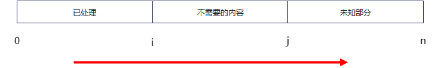
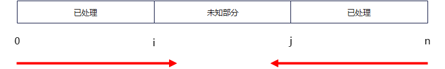

# 1 概述

Array类型题型，一般而言题目中数据都有固定长度或者数量，通常使用双指针的方式解决此类问题。此处双指针不一定就是两个指针，同时也不一定是真实的指针，而且多数是数组下标的处理方式，主要是指使用双指针的思维，比如同向移动指针或者反向移动指针。

# 2 同向双指针方式

使用下图表示同向双指针的思考方式：



同向双指针将数据分为三个区域：

1. [0, i) 表示处理好的数据
2. [i, j) 表示处理过但是不需要的数据
3. [j, array.len) 表示接下来要处理的数据

那么一般此类题的通用步骤就是：

1. 初始化下标i, j
2. while (j < array.len)
   (1)如果需要array[i], 可以array[i] == array[j], 然后向前移动i， 其中i是下一个要保存的位置
   (2) 不需要array[j]的话，就跳过它，继续判断array[j+1]， 而i不需要移动位置

如leetCode 26. 删除有序数组中的重复项
```c++
class Solution {
public:
    int removeDuplicates(vector<int>& nums) {
        if (nums.size() == 0) {
            return 0;
        }
        int i = 0, j = 1;
        while (j < nums.size()) {
            if (nums[i] == nums[j]) {  //重复元素，不需要nums[j], 继续处理num[j+1]
                j++;
            } else {
                nums[++i] = nums[j]; //非重复元素，需要nums[j], 使用num[i+1]保存，即使用重复元素位置保存
            }
        }

         //在处理过程中, [0, i)为非重复元素，[i, j)为重复元素， [j, nums.size())为待处理元素
        return i + 1;
    }
};
```
# 3 反向向双指针方式

使用下图表示反向双指针的思考方式：



反向双指针将数据分为三块区域：
其中[0, i)和(j, array.len)为处理好的数据， [i, j]为待处理。

此类问题的一般步骤就是：

1. 初始化指针i = 0, j = array.len - 1
2. while (i <= j)
   (1) 考虑array[i]和array[j]需要做的事情
   (2) 至少移动一个指针

如leetCode 344. 反转字符串
```c++
//两侧靠近反向双指针
//左 -->  <-- 右
class Solution {
public:
    void reverseString(vector<char>& s) {
        int i = 0, j = s.size() - 1;

        while (i <= j) {
            char t = s[i];
            s[i] = s[j];
            s[j] = t;
            //i++, j--即反向指针
            i++;
            j--;
        }
    }
};
```
leetCode 5. 最大回文子串
```c++
//中心扩展反向双指针
// <--  中心  -->
void longestSingle(string &s, int pos, int *begin, int *max) {
    int left = pos;
    int right = pos;
    int i = 0;

    //找到与pos位置值相同的范围边界
    while (left >= 0 && s[left] == s[pos]) left--;
    while (right < s.size() && s[right] == s[pos]) right++;

    //由中心向外扩展，判断是否回文
    while (i < s.size() / 2 + 1 && left >= 0 && right < s.size()){
        if (s[left] != s[right]) {
            break;
        } else {
            left--;
            right++;
        }
    }
    
    //由于前两个while一定会执行，因此可以将放心的left++和right--来找到准备的范围，而不必担心越界问题
    left++;
    right--;

    *begin = left;
    *max = right - left + 1;
}
string longestPalindrome(string s) {
    if (s.size() < 2) return s;

    int maxLen = 1;
    int begin = 0;
    int n = s.size();

    for (int i = 0; i < n; i++) {
        int be, max;
        longestSingle(s, i, &be, &max);
        if (max > maxLen) {
            begin = be;
            maxLen = max;
        }
    }

    return s.substr(begin, maxLen);
}
```
