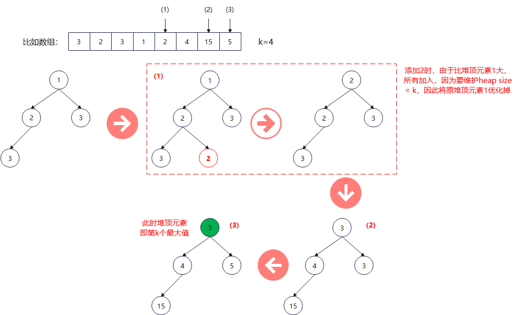

# 1 heap简介

heap本质上是用Array或者vector实现的完全二叉树，这个tree的root节点代表整个heap的最大值（max_heap）或最小值（min_heap）。

常用于解决Top K问题。

C++并没有将heap作为容器，而是作为算法放到< algorithm>中，默认是max_heap，但是也可以通过指定比较算法构造min_heap。heap的低层机制vector本身就是一个类模板， 常用的API有以下几个：

- std::make_heap(RandomIt first, RandomIt last, Compare comp): 在范围 [first, last) 中构造最大堆
- std::push_heap(RandomIt first, RandomIt last, Compare comp): 插入位于位置 last-1 的元素到范围 [first, last-1) 所定义的最大堆中
- std::pop_heap(RandomIt first, RandomIt last, Compare comp): 交换在位置 first 的值和在位置 last-1 的值，并令子范围 [first, last-1) 变为堆。这拥有从范围 [first, last) 所定义的堆移除首个元素的效果。如果想真实的从容器中删除需要调用pop_back()

make_heap之后的堆顶元素需要使用front()，而访问push_heap之后，max元素实际在back()。

# 2 例题

LeetCode 215:  数组中的第K个最大元素
给定整数数组 nums 和整数 k，请返回数组中第 k 个最大的元素。

思路：
可以通过维护一个size为k的min_heap，在heap size < k时元素直接放入heap中，当size >= k时，将准备添加的元素与heap顶部元素比较，如果>=顶部元素，则将堆顶元素去掉，将准备添加的元素放入堆中， 否则丢弃。

如果处理完毕数组中所有元素之后，堆中的元素一定是k个比较大的，而堆顶元素则是第k个最大的元素。



上图是算法过程的示意图， 具体的代码实现如下：

```c++
class Solution {
public:
    int findKthLargest(vector<int>& nums, int k) {
        vector<int> heap(nums.begin(), nums.begin() + k);
        std::make_heap(heap.begin(), heap.end(), std::greater<>{}); //生成size = k的min_heap

        for (int i = k; i < nums.size(); i++) {
            if (nums[i] >= heap.front()) {
                std::pop_heap(heap.begin(), heap.end(), std::greater<>{}); //弹出堆顶元素
                heap.pop_back();
                heap.push_back(nums[i]);
                std::push_heap(heap.begin(), heap.end(), std::greater<>{}); //插入新元素后调整堆
            }
        }
        return heap.front();
    }
};

```
