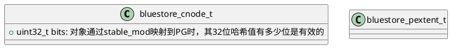
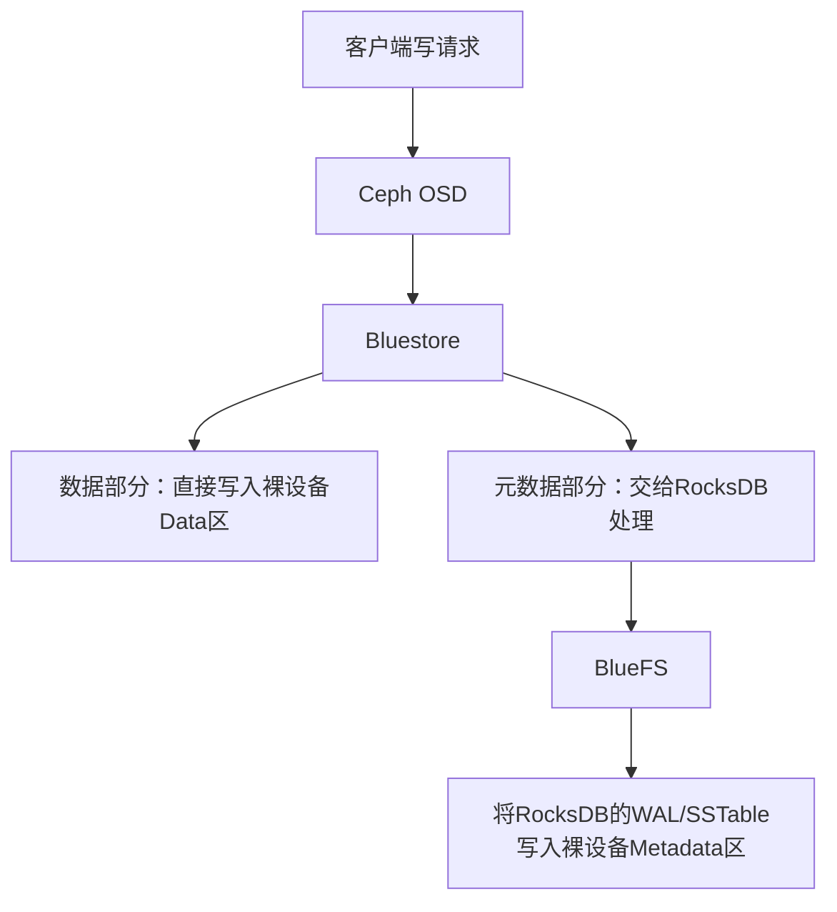
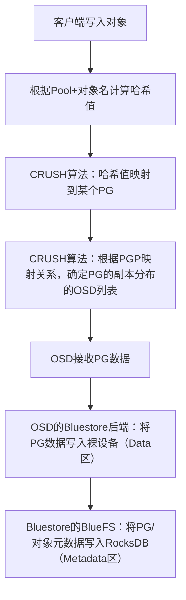

---
年份:
  - "2025"
写作年份:
  - "2025"
状态:
  - 进行中
imageNameKey: bluefs
tags:
  - ceph
  - bluefs
  - 技术学习
---
[TOC]

# 1 简介
BlueStore默认使用RocksDB作为元数据存储引擎。同时，由于操作系统自带的本地文件系统（例如XFS、ext3、ext4、ZFS等）对RocksDB而言很多功能不是必须，为了进一步提升RocksDB的性能，需要对本地文件系统进行裁剪

RocksDB、BlueFS和BlueStore整体架构图:
![[2025-06-24-bluefs-IMG.png|225]]

BlueStore针对写请求综合运用了RMW和COW策略：任何一个写请求，根据磁盘块大小，将其切分为3个部分，即首尾非块大小对齐部分与中间块大小对齐部分，然后针对中间块对齐部分采用COW策略，首尾非块对齐部分采用RMW策略。

所有读请求都是同步的，而写请求出于效率考虑一般需要设计成异步的，BlueStore为每个PG设计一个队列，用于对所有归属于该PG的写请求进行保序。这个队列称为OpSequencer，不同类型的ObjectStore实现略有不同。

BlueStore绕过了本地文件系统，由自身直接接管裸设备，所以元数据类型要丰富得多，除了PG和对象对应的数据结构之外，还有大量与磁盘空间管理相关的数据结构。需要注意的是，在BlueStore中，每种类型的数据结构一般都有磁盘和内存两种格式，习惯上前者采用全部小写、以下划线`“_”`作为分隔符并且固定以字母t结尾的命名方式，而后者采用首字母大写的命名方式。

Bluestore 是 Ceph OSD 的主存储后端（负责数据持久化），bluefs 是 bluestore 配套的小型文件系统（负责管理 bluestore 的元数据和 WAL/DB 设备），二者是 “主存储 + 元数据管理” 的依存关系。

- **bluestore**：Ceph OSD 存储数据的核心引擎，直接处理对象数据的写入、读取、删除。它替代了早期的 filestore，专为块存储优化，数据直接写入裸设备（或分区），无需依赖外部文件系统（如 XFS），本身不处理文件级的元数据管理，将这部分工作交给 bluefs。
- **bluefs**：bluestore 内置的轻量级文件系统，不存储用户数据，仅管理 bluestore 所需的元数据和辅助数据。比如 WAL（写日志，保障数据一致性）、RocksDB 实例（存储 bluestore 的元数据）、临时文件等，可使用独立的存储设备（如高速 SSD）存放 WAL 和 DB，避免与数据盘（HDD）竞争 IO，提升 bluestore 读写性能。若未配置独立的 WAL/DB 设备，bluefs 会默认使用 bluestore 的数据盘（同一设备分区）存储相关文件。

## 1.1 概念
### 1.1.1 对象内容和语义
> 来自src/os/ObjectStore.h的注释

所有的ObjectStore对象在命名的集合中使用名字标识，ObjectStore支持集合中创建、修改、删除和遍历对象。对象名字全局唯一。
每个对象有四个不同部分：字节数据、扩展属性、omap_header和omap entries。


### 1.1.2 Collections
“Collections”（集合）是核心数据组织概念之一，主要用于 **对象（Object）的分组管理**，常见于 RGW（对象网关）、BlueStore 等组件中。
集合本质是**对象的容器**，用于将多个相关对象归类（类似文件系统中的 “目录”，但更轻量、更抽象）。例如，在 RGW 中，一个用户的所有对象可能被组织到一个或多个集合中；在 BlueStore 中，集合可能用于管理 OSD 上的一组相关元数据对象。

集合的特点：
- **命名与标识**：每个集合有唯一名称，类型为 `coll_t`（Ceph 自定义的集合标识类型），用于准确定位集合。
- **可枚举性**：集合中的对象支持按顺序遍历（如按对象 ID、创建时间排序），便于批量操作（如列举、统计、迁移）。

集合和单个对象一样，拥有 **扩展属性（xattrs，Extended Attributes）**，以 `std::set` 数据结构存储（键值对形式）。
Ceph 中的 Collections 是 “对象 - 集合 - 元数据” 三层结构的核心中间层，既保证了数据组织的灵活性，又为上层功能（如权限、查询）提供了底层支持。
**Collections（集合）** 与其他核心概念（如 Object、PG、Pool、Bucket 等）既有联系又有明确区别，核心差异体现在**粒度、功能定位和适用场景**上。以下是具体对比：

| 概念         | 粒度      | 核心功能                    | 依赖关系                    | 典型场景                   |
|------------|---------|-------------------------|-------------------------|------------------------|
| Collection | 对象的逻辑分组 | 组织对象、存储分组元数据（xattrs）    | 隶属于 Pool，包含多个 Object    | RGW 后端、BlueStore 元数据管理 |
| Object     | 最小数据单元  | 存储用户数据和自身元数据            | 隶属于 Collection          | 存储实际文件 / 对象数据          |
| PG         | 数据分布单位  | 负责数据冗余、映射到 OSD          | 隶属于 Pool，包含多个 Object    | 数据可靠性、集群负载均衡           |
| Pool       | 最高级隔离单位 | 资源隔离、独立配置（副本数、PG 数量等）   | 包含 PG、Collection、Object | 多租户隔离、业务资源划分           |
| Bucket     | 用户级容器   | 提供 S3/Swift 兼容接口，面向用户操作 | 底层由 Collection 实现       | RGW 对象存储用户交互           |

Collection和Onode，分别对应PG上下文与对象上下文的内存管理结构。

# 2 类图




## 2.1 详细数据结构

[[assets/BlueStore数据结构梳理.drawio|BlueStore数据结构梳理]]

# 3 处理流程梳理

1. [[assets/OSD函数调用图.xmind]]
2. [[assets/BlueStore函数调用图.xmind]]

# 4 磁盘数据结构
1. PG对应的磁盘数据结构称为bluestore_cnode_t（简称cnode)
2. 对象：采用逻辑段的方式，每个extent都可以写成{offset, length, data}的三元组，其中data是个抽象数据类型，主要用于从磁盘上索引对应逻辑段包含的数据。考虑到磁盘空间碎片化严重时，我们可能无法保证为每个逻辑上连续的段（即extent）分配物理上也连续的一段空间，即逻辑段与磁盘上的物理空间段应该是一对多的关系，因此data在设计上主要包含一些物理空间段的集合，每个段对应磁盘上的一块独立存储空间，BlueStore称之为bluestore_pextent_t（简称pextent）​。
```c++
struct extent {
    offset; //对象逻辑偏移，从0开始编址
    length; //逻辑段的长度
    data; //逻辑段包含的数据，为抽象数据类型
}


struct bluestore_pextent_t {
    offset: 磁盘上的物理偏移
    length: 长度
}
```
- 数据校验：BlueStore的解决方案比较简单，它直接将校验和单独使用数据库保存
- 数据压缩：采用数据压缩算法需要固化两个关键信息：一是选用的压缩算法；二是压缩后的数据长度。BlueStore使用压缩头保存这两个信息
```c++
struct bluestore_shared_blob_t {
    type: 压缩算法类型
    length: 数据压缩后的长度
}
```
- 数据共享：数据共享主要指extent在不同对象之间的共享，一般由对象克隆操作引入。当某个extent的数据被多个对象共享时，需要使用一个中立结构来表明这些数据的共享信息。需要记录的共享信息主要包括共享数据的起始地址、数据长度和被共享的次数。因此，这个中立结构通常可以写成{offset，length，refs}这样的三元组形式， BlueStore称之为bluestore_shared_blob_t，其主要内容是一张基于extent的引用计数表。
3. extent三元组中的data抽象数据类型如上三类，BlueStore称之为blob
4. 每个onode包含一张extent-map，extent-map包含若干extent，每个extent负责管理一个逻辑段内的数据并关联一个blob，blob通过若干pextent最终将这些数据映射至磁盘
5. BlueStore将每个onode的存储空间划分为3部分，分别是：数据（如前所述，使用extent-map管理）​、扩展属性和omap
# 5 磁盘空间管理
1. BlueStore选择将空闲空间列表存盘，系统上电时，通过加载空闲空间列表，最终可以在内存中还原出完整的已分配空间列表。
2. BlueStore使用FreelistManager与Allocator两种抽象数据类型来分别管理空闲空间列表和已分配空间列表，两者又各有段和位图两种具体实现形式。
## 5.1 BitmapFreelistManager
BitmapFreelistManager以块为粒度，将数量固定、物理上连续的多个块进一步组成一个段，从而将整个磁盘空间划分为若干连续的段进行管理。每个段以其在磁盘中的起始地址进行编号，可以得到一个BlueStore实例内唯一的索引，从而可以使用数据库固化BitmapFreelistManager中的所有段信息。

## 5.2 BitmapAllocator
BitmapAllocator实现了一个块粒度的内存版本磁盘空间分配器。与Bitmap-FreelistManager不同，BitmapAllocator中的数据不需要使用数据库存盘，所以可以采用非扁平方式进行组织，以提升索引效率。
![[assets/2025-11-12-bluefs-IMG.png|500]]

# 6 BlueFs
BlueFS是个简易的用户态日志型文件系统，它恰到好处地实现了RocksDB::Env所定义的全部API。这些API主要用于固化RocksDB运行过程中产生的.sst（对应SSTable）和.log（对应WAL）文件。由于WAL非常影响RocksDB的性能，所以BlueFS设计上支持.sst和.log文件分开存储，以方便将.log文件单独保存在速度更快的固态存储设备（例如NVMe SSD或者NVRAM）之上。
BlueFS后，BlueStore将所有存储空间从逻辑上分成了3个层次：
1. 慢速(Slow)空间: 这类空间主要用于存储对象数据，可由普通大容量机械磁盘提供，由BlueStore自行管理。
2. 高速(DB)空间: 这类空间主要用于存储BlueStore内部产生的元数据（例如onode）​，可由普通SSD提供，容量需求比1）小。由于BlueStore的元数据都交由RocksDB管理，而RocksDB最终通过BlueFS保存数据，所以这类空间由BlueFS直接管理。
3. 超高速(WAL)空间：这类空间主要用于存储RocksDB内部产生的.log文件，可由NVMe SSD或NVRAM等时延相较普通SSD更小的设备充当，容量需求和2）相当（实际上还取决于RocksDB相关参数设置）​。超高速空间也由BlueFS直接管理。

理论上单个BlueStore实例能够保存的onode只受存储容量的限制，为了防止上电时从磁盘读取大量onode（从而延长上电时间）​，BlueStore需要额外固化一张空闲空间列表。
BlueFS既不保存空闲空间列表，也不保存已分配空间列表，而是通过上电时遍历所有文件的元数据信息来生成完整的已用空间列表，即Allocator。

BlueFS 是 Bluestore 内置的**专用日志型文件系统**，并非通用文件系统（不能独立使用），核心作用是为 Bluestore 中的 RocksDB 提供文件系统接口，同时管理 Bluestore 的元数据和 WAL（预写日志）。
BlueFS 的核心功能：
- **介质分层管理**：将 RocksDB 的不同文件（WAL、SSTable、元数据）分别存储到不同介质（如 WAL 放最快的 NVMe SSD，SSTable 放普通 SSD）；
- **日志式写入**：对元数据操作采用日志方式，保证原子性，避免数据丢失；
- **精简的元数据管理**：只维护 RocksDB 所需的最小化文件元数据（无目录树、权限等通用文件系统特性），极致轻量化；
- **空间管理**：直接管理裸设备的块分配，避免通用文件系统的碎片问题。

BlueFS 的存储布局：

| 区域          | 作用                        | 特点          |
|-------------|---------------------------|-------------|
| Super Block | 存储 BlueFS 自身的元数据（版本、布局）   | 只读，小体积      |
| Log         | 存储写操作日志（类似文件系统的 journal）  | 顺序写，高性能     |
| Data        | 存储 RocksDB 的数据文件（SSTable） | 随机读写，按需分配空间 |

## 6.1 磁盘数据结构
BlueFS的磁盘数据主要包括文件、目录和日志3种。
BlueFS只用于存储单个BlueStore实例的元数据，所存储的文件规格比较统一（绝大多数为SSTable）​，并且数量十分有限，所以可以直接采用扁平结构进行组织。
BlueFS定位某个具体文件一共需要经过两次查找：第一次通过dir_map找到文件所在的最底层文件夹（即目录）​；第二次通过该文件夹下的file_map找到对应的文件。

上电时，我们总是先通过日志重放来获取BlueFS的所有元数据，所以还需要一个固定入口，用于索引日志（日志本身采用一个单独的文件进行保存）所对应的存储位置。这个入口称为超级块（SuperBlock，常见的本地文件系统都有类似的概念）​，BlueFS总是将其保存在DB设备的第二个4kB的存储空间

## 6.2 主要操作
### 6.2.1 mkfs
函数原型: `int BlueFS::mkfs(uuid_d osd_uuid, const bluefs_layout_t& layout)`


### 6.2.2 mount
函数原型：`int BlueFS::mount()`


### 6.2.3 read
函数原型：`BlueFS::read(uint8_t ndev, uint64_t off, uint64_t len, ceph::buffer::list *pbl, IOContext *ioc, bool buffered)`

# 7 BlueStore
Bluestore 和 BlueFS 都是 Ceph 分布式存储系统中针对**块设备（如 SSD/HDD）** 优化的核心组件，其中 Bluestore 是新一代的 OSD（Object Storage Daemon）存储后端，而 BlueFS 是 Bluestore 内置的轻量级文件系统，二者是**包含与被包含**的关系。
Bluestore 是 Ceph 为解决传统 FileStore（基于本地文件系统如 XFS/EXT4）性能瓶颈而设计的**裸设备存储后端**，直接管理裸块设备（无需本地文件系统封装），是目前 Ceph 推荐的默认 OSD 存储后端。

 **Bluestore 的核心组成**：
 
| 组件       | 作用                                           | 推荐介质          |
|----------|----------------------------------------------|---------------|
| Data     | 存储实际的对象数据（大文件、块数据）                           | HDD / 大容量 SSD |
| Metadata | 存储对象的元数据（如对象位置、大小、属性）                        | 高性能 SSD       |
| RocksDB  | 存储 Bluestore 的核心元数据（如对象映射、事务日志），依赖 BlueFS 管理 | 高性能 SSD       |


## 7.1 DB
### 7.1.1 kv store前缀
```c++
const string PREFIX_SUPER = "S";       // field -> value
const string PREFIX_STAT = "T";        // field -> value(int64 array)
const string PREFIX_COLL = "C";        // collection name -> cnode_t
const string PREFIX_OBJ = "O";         // object name -> onode_t
const string PREFIX_OMAP = "M";        // u64 + keyname -> value
const string PREFIX_PGMETA_OMAP = "P"; // u64 + keyname -> value(for meta coll)
const string PREFIX_PERPOOL_OMAP = "m"; // s64 + u64 + keyname -> value
const string PREFIX_DEFERRED = "L";    // id -> deferred_transaction_t
const string PREFIX_ALLOC = "B";       // u64 offset -> u64 length (freelist)
const string PREFIX_ALLOC_BITMAP = "b";// (see BitmapFreelistManager)
const string PREFIX_SHARED_BLOB = "X"; // u64 offset -> shared_blob_t
const string BLUESTORE_GLOBAL_STATFS_KEY = "bluestore_statfs";
```

## 7.2 主要结构

## 7.3 CollectionIndex
Collection的概念对应到本地文件系统中就是一个目录，用于存储一个PG里的所有的对象。
一个collection对应本地文件系统的一个目录，一个PG对应于一个Collection，该PG的所有对象都保存在这个目录里，定义在类coll_t中：
```c++
class coll_t {
	enum type_t {
		TYPE_META = 0,
		TYPE_LEGACY_TEMP = 1,  /* no longer used */
		TYPE_PG = 2,
		TYPE_PG_TEMP = 3,
	};
	
	type_t type;                 //类型： meta、pg、temp
	spg_t pgid;                  //对应的pgid
	uint64_t removal_seq;        //这个字段不再使用，没有编码持久化存储

	char _str_buff[spg_t::calc_name_buf_size];
	char *_str;                  //缓存的字符串
};
```
collection有三种不同的类型： TYPE_META类型表示这个PG里保存的是元数据(meta)相关的对象；TYPE_PG表示该collection保存的是PG相关的数据； TYPE_TEMP保存临时对象。

### 7.3.1 ObjectStore::CollectionImpl
Collection对事务排序，一个给定的collection下面的任何排序的事务，都会顺序应用。不同collection下面排队的事务可以并发执行。
```c++
struct CollectionImpl : public RefCountedObject {
    
}

```


## 7.4 主要操作

### 7.4.1 mkfs
函数原型：`int BlueStore::mkfs()`，主要作用是创建或者打开bdev、数据库等信息
1. `BlueStore::_open_db`: 通过配置项bluestore_kvbackend指定后端的kvdb，默认rocksdb
### 7.4.2 mount
函数原型：`int BlueStore::mount()`

### 7.4.3 read
函数原型：`int BlueStore::read(...)`，read接口用于读取对象指定范围内的数据，目前BlueStore实现的read接口是同步的。主要涉及查找Collection、查找Onode、读缓存和读磁盘等操作
#### 7.4.3.1 查找Collection

#### 7.4.3.2 查找Onode

#### 7.4.3.3 读缓存

#### 7.4.3.4 读磁盘


### 7.4.4 write
write在内的所有涉及数据修改的操作，都需要通过queue_transactions接口，以事务组的形式提交至BlueStore。

## 7.5 辅助函数

## 7.6 读取DB配置
处理函数：
```bash
int RocksDBStore::load_rocksdb_options(bool create_if_missing, rocksdb::Options& opt)
```


# 8 拾遗
kvstore_tools.cc

## 8.1 osd部署
ceph-volume lvm create
ceph-volume lvm activate

src/ceph-volume/ceph_volume/main.py

### 8.1.1 旧流程
1. create_cluster
    1. create_all_cms - 启动ceph-mon
    2. create_all_smd - 启动ceph-mgr
    3. create_all_su - 启动ceph-osd
        1. init_recovery_mode
        2. prepare_su
        3. create_all_qlc_su
        4. activate_all_su: python3 /usr/sbin/ceph-volume lvm activate --all
        5. update_crush_map
        6. update_default_pool
    4. set_init_cms


# 9 工具
ceph_kvstore_tool


# 10 重点摘要
1. 对象基于extent，即基于逻辑段组织： {offset，length，data}，每个data逻辑段（bluestore_blob_t）对应多个磁盘上的物理空间段，每个物理空间段对应磁盘上的一块独立存储空间，即bluestore_pextent_t

# 11 与其他模块关系
## 11.1 Bluestore 与 PG/PGP Pool
Bluestore、PG（Placement Group）、PGP Pool 是 Ceph 存储系统中**不同层级**的核心概念：

- Bluestore 是**存储介质层**的 OSD 后端（负责数据落地）；
- PG 是**数据分布层**的核心单元（负责数据分片与映射）；
- PGP Pool 是 PG 的 “预分配 / 映射池”（保障 PG 迁移 / 扩容时的数据均衡）；

三者的核心关联是：**PG 是数据分配的最小逻辑单元，最终会映射到具体的 OSD 上，而 OSD 则通过 Bluestore 将 PG 中的数据持久化到物理介质**。
### 11.1.1 PG（Placement Group）：数据分布的核心

#### 11.1.1.1 概念
PG 是 Ceph 为解决 “对象直接映射到 OSD 会导致元数据爆炸” 而设计的**逻辑分片单元**：
- 一个 Pool（存储池）会被划分为多个 PG；
- 每个对象通过 CRUSH 算法计算后，会被映射到某个 PG 中；
- 每个 PG 会有多个副本（或纠删码分片），分布在不同 OSD 上；

#### 11.1.1.2 PG 与 Bluestore 的关联

- 一个 PG 的数据最终会落地到一个或多个 OSD（副本数决定）；
- OSD 采用 Bluestore 作为存储后端时，会将 PG 的数据（对象 + 元数据）直接写入裸设备（而非本地文件系统）；
- Bluestore 对 PG 的优化：
    
    - 为每个 PG 分配独立的逻辑空间，减少不同 PG 之间的 IO 干扰；
    - 通过内置的 RocksDB（由 BlueFS 管理）记录 PG 的元数据（如对象位置、版本）；
    - 支持 PG 级别的数据校验、压缩，提升 PG 数据的读写性能。

### 11.1.2 PGP Pool（PG Placement Pool）：PG 的 “映射池”
#### 11.1.2.1 概念
PGP 是 PG 的 “预分配映射数”，PGP Pool 本质是 Ceph 为 Pool 预留的 “PG 映射槽位”：
- PGP 的数值**默认等于 PG 数**，用于决定 CRUSH 算法为 PG 分配 OSD 的范围；
- 当需要扩容（增加 OSD）或调整 PG 副本策略时，PGP 会先 “预分配” 新的映射关系，再逐步迁移 PG 数据，避免数据分布不均；
#### 11.1.2.2 PGP 与 PG/Bluestore 的关联
- PGP 不存储实际数据，仅管理 PG 到 OSD 的映射关系；
- 调整 PGP 数时，会触发 PG 在不同 OSD 间的迁移，而 Bluestore 作为 OSD 的存储后端，会负责 PG 数据的读写、删除（迁移过程）；
- 若 PGP 数远大于 PG 数，会导致 PG 映射分散，增加 Bluestore 的 IO 开销；若过小，扩容时数据均衡效率低。



### 11.1.3 核心区别和联系
| 概念        | 层级    | 核心作用               | 与其他概念的关联                 |
|-----------|-------|--------------------|--------------------------|
| Bluestore | 存储介质层 | 数据落地（裸设备管理）、性能优化   | 承载 PG 的数据，管理 PG 元数据      |
| PG        | 数据分布层 | 数据分片、副本管理、故障恢复     | 映射到 OSD，数据由 Bluestore 存储 |
| PGP Pool  | 映射管理层 | 预分配 PG 到 OSD 的映射关系 | 保障 PG 分布均衡，不直接接触数据       |

# 12 相关链接
1. [[OSD随记]]
