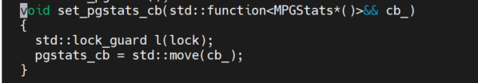
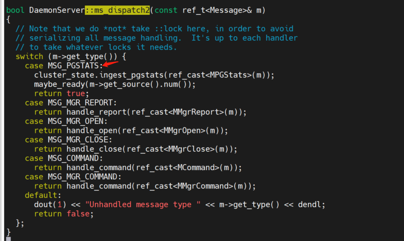
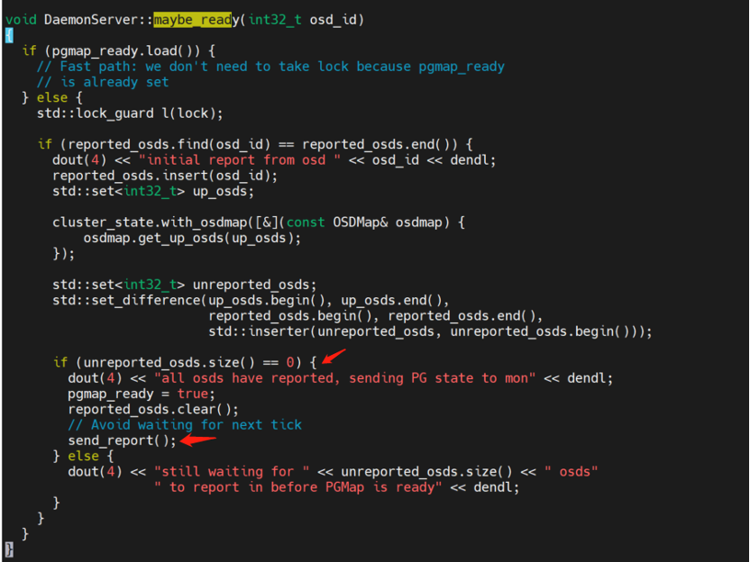
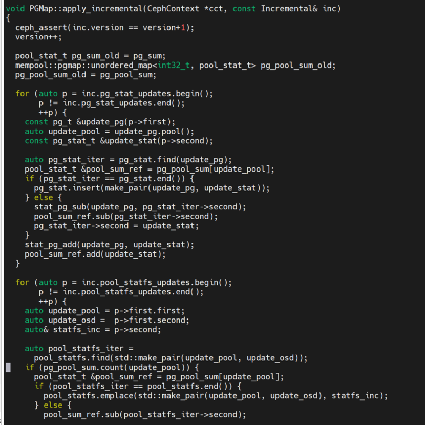
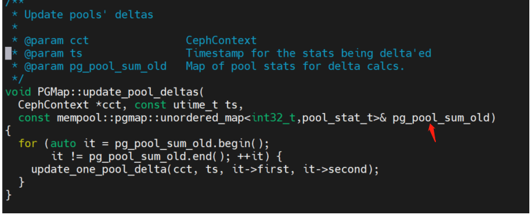

1. osd收集stats信息  `OSD.cc::collect_pg_stats()`
2. osd初始化时，初始化一个report线程，给mgr报告pgstat
```c++
int OSD::init()
	->mgrc.set_pgstats_cb([this](){ return collect_pg_stats(); });
```

set_pgstats_cb 函数是mgr的mgrclient.cc提供的，意思是osd在初始化时，初始化一个线程定期给mgr报告pgstat




这个定时器的间隔是stats_period，对应的配置是5秒
```c++
_send_stats
	->_send_pgstats
		->send_message
```

3. mgr接收osd发送的pgstat


4. mgr收到所有osd发送的pgstats后，给mon发送报告


5. Mon开始更新pgmap


6. Mon对pool计算增量

```c++
ClusterState::ingest_pgstats
ClusterState::notify_osdmap

//一个是单个 OSD 上报的消息 MPGStats
//另一个是集群的 osdmap 的变化，包括osdmap和pgmap。
```

需要收到mon发送的变化后的osdmap，然后需要收到每一个osd发送的pgstat，所以从新增加一个pool，到mon里有这个pool的信息，需要一些时间。
osd的定时器是5秒，mgr收到所有osd的报告，才会给mon发送pgstat。