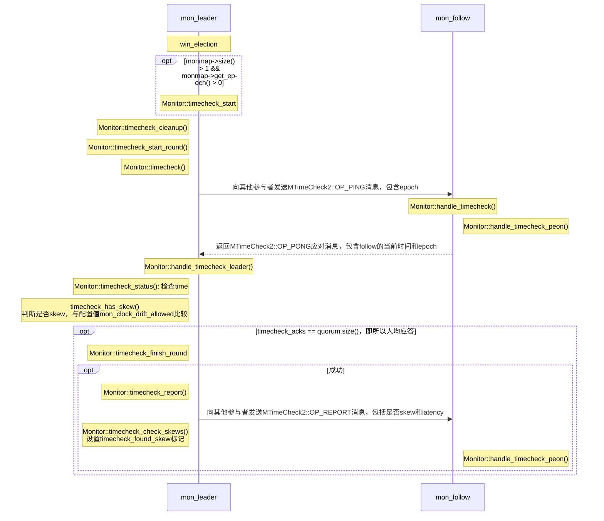

---
状态:
  - 完成
年份:
  - "2025"
imageNameKey: Monitor时间偏差检查
tags:
  - 技术学习
---
# 1 处理流程框架

```mermaid
sequenceDiagram
    participant mon_leader
    participant mon_follow
    note over mon_leader: win_election
    opt monmap->size() > 1 && monmap->get_epoch() > 0
        note over mon_leader: Monitor::timecheck_start
    end
    note left of mon_leader: Monitor::timecheck_cleanup()
    note left of mon_leader: Monitor::timecheck_start_round()
    note left of mon_leader: Monitor::timecheck()
    mon_leader ->> mon_follow: 向其他参与者发送MTimeCheck2::OP_PING消息，包含epoch
    note over mon_follow: Monitor::handle_timecheck()
    note right of mon_follow: Monitor::handle_timecheck_peon()
    mon_follow -->> mon_leader: 返回MTimeCheck2::OP_PONG应对消息，包含follow的当前时间和epoch
    note over mon_leader: Monitor::handle_timecheck_leader()
    note left of mon_leader: Monitor::timecheck_status(): 检查time
    note left of mon_leader: timecheck_has_skew() <br> 判断是否skew，与配置值mon_clock_drift_allowed比较
    opt timecheck_acks == quorum.size()，即所以人均应答
          note left of mon_leader: Monitor::timecheck_finish_round
          opt 成功
               note left of mon_leader: Monitor::timecheck_report()
               mon_leader ->> mon_follow:  向其他参与者发送MTimeCheck2::OP_REPORT消息，包括是否skew和latency
               note left of mon_leader: Monitor::timecheck_check_skews() <br> 设置timecheck_found_skew标记
               note right of mon_follow: Monitor::handle_timecheck_peon()
          end
    end 
```
# 2 流程梳理解析
TODO

# 3 相关链接
1. [Monitor时间偏差检查](http://10.128.106.117/pages/viewpage.action?pageId=127406200)
