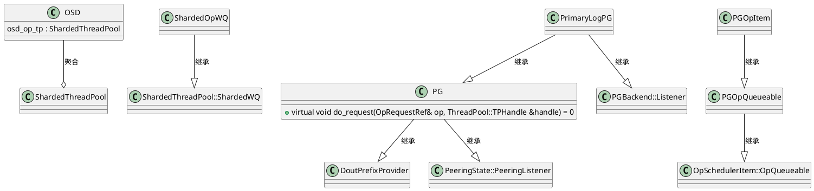

---
状态:
  - 进行中
年份:
  - "2025"
imageNameKey: PG状态机
tags:
  - 技术学习
  - ceph
  - pg
---
# 1 状态机
状态迁移常用于表征PG在不同任务之间进行了切换，或者任务进度发生了变化，PG状态机有外部状态和内部状态，外部状态可以通过ceph -s观察到，PG内部通过状态机来驱动PG在不同外部状态之间进行迁移，因此，相应地PG有内外两种状态。

外部状态机如图所示：
![[assets/IMG-2025-09-11-11.png|500]]

![[assets/2025-09-11-PG状态机-IMG.png|500]]

# 2 PG-读写流程
## 2.1 概念

head对象即**原始对象**。

引入快照机制之后，如果被改写的对象存在快照，为了支持快照回滚操作，一般需要先针对原始对象执行克隆，然后才真正改写原始对象，即产生**克隆对象**。但是有两个特殊场景需要额外考虑——删除原始对象和重新创建原始对象

对象有两个关键属性（对客户端不可见），分别用于保存对象的基本信息和快照信息，通常称为**OI(Object Info)**和SS(Snap Set)**属性。

- object_info_t： 对象OI属性的磁盘结构，保存对象除快照之外的元数据
- ObjectState： object_info_t的内存版本，在其基础上增加了一个exists字段，用于指示对象逻辑上是否存在
- SnapSet： 对象SS属性的磁盘结构，保存对象快照及克隆信息
- SnapSetContext：SnapSet的内存版本，主要增加了引用计数机制，便于SS属性在head对象与克隆对象之间共享
- SnapContext：如果是客户端自定义快照模式（例如RBD，可以针对每个image单独执行快照操作），那么由客户端下发的请求自身会携带SnapContext，包含此客户端当前所有的快照信息；如果是存储池快照模式，那么PGPool关联的SnapContext会包含此存储池当前所有的快照信息。
- ObjectContext：保存了对象的OI与SS属性，此外，内部实现了一个属性缓存（主要用于缓存用户自定义属性对）和读写互斥锁机制，后者用于对来自客户端的请求进行保序。
- Log：顺序记录了客户端写请求的概要消息，使用PG元数据对象的omap保存，所有日志使用一个日志队列进行管理
- OpContext：PG将所有来自客户端的请求和集群内部诸如执行数据恢复、Scrub等任务产生的请求都统称为op
- RepGather：如果op包含写操作，通常情况下需要由Primary主导，在副本之间发起分布式写。RepGather用于（取代op）追踪该分布式写在副本之间的完成情况

## 2.2 消息队列

每个客户端的读写请求首先被OSD封装成一个op，然后按其携带的PGID投递至某个op_shardedwq队列进行处理。

op_shardedwq是一种工作队列(Work Queue)，sharded关键字表明其内部可以存在多个队列。op_shardedwq最终关联osd_op_tp线程池，由池中线程真正对op进行处理

## 2.3 do_request
do_request作为PG处理op的第1步，主要完成一些全局（PG级别的）检查

![[assets/PG-读写流程.excalidraw]]

## 2.4 PrimaryLogPG
`PrimaryLogPG::do_osd_ops`  

# 3 PG分裂与集群扩容  

