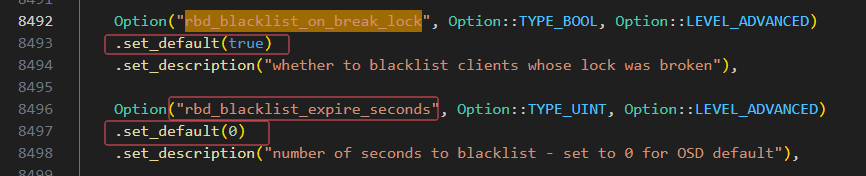
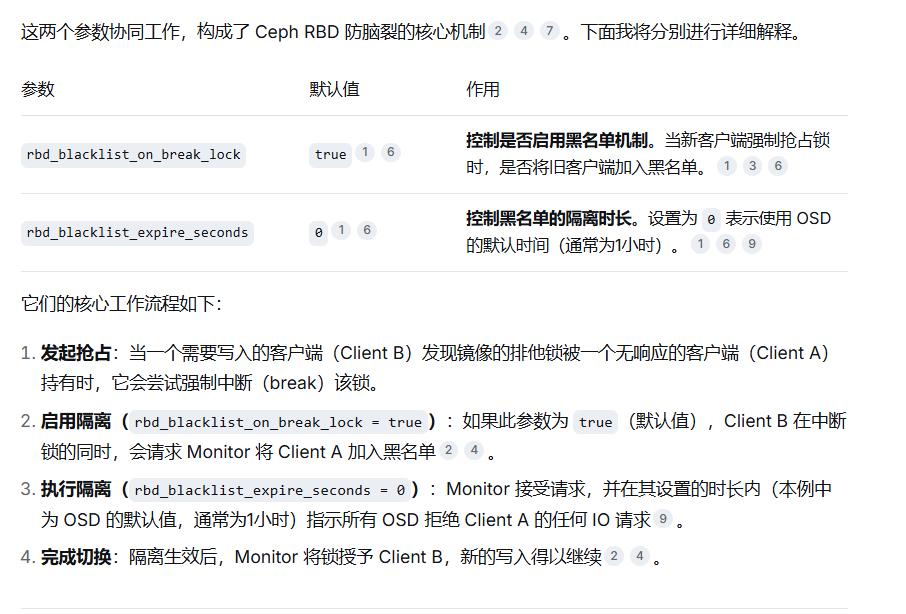
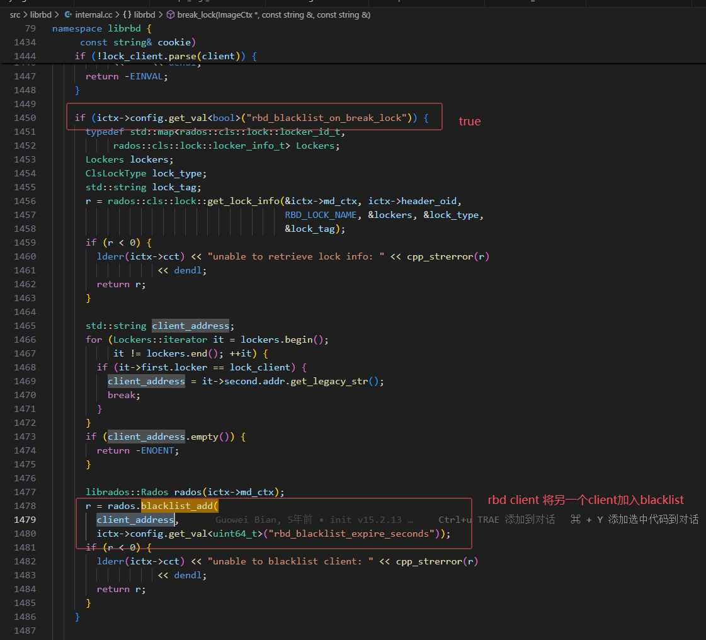

---
写作年份:
  - "2025"
imageNameKey: rbd简要介绍
tags:
  - ceph
  - rbd
---
# 1 RBD架构与介绍
Ceph 可以同时提供 RADOSGW(对象存储网关)、 RBD(块存储)、 Ceph FS(文件系统存储)，RBD 即 RADOS Block Device 的简称， RBD 块存储是常用的存储类型之一， RBD 块设备类似磁盘可以被挂载， RBD 块设备具有快照、 多副本、 克隆和一致性等特性， 数据以条带化的方式存储在 Ceph 集群的多个 OSD 中。

**条带化技术**就是一种自动的将 I/O 的负载均衡到多个物理磁盘上的技术， 条带化技术就是将一块连续的数据分成很多小部分并把他们分别存储到不同磁盘上去。 这就能使多个进程同时访问数据的多个不同部分而不会造成磁盘冲突， 而且在需要对这种数据进行顺序访问的时候可以获得最大程度上的 I/O 并行能力， 从而获得非常好的性能。

# 2 空间
构包含两部分：**数据对象**（实际存储用户数据）和**元数据对象**（描述镜像属性、快照关系、映射信息等）。
### 2.1.1 一、RBD 元数据与数据的存储结构

1. **数据对象（Data Objects）**
    - 用于存储用户实际写入的数据，按固定大小（默认 4MB，可通过 `rbd_default_obj_size` 配置）拆分为多个 RADOS 对象。
    - 命名格式：`rbd_data.<image-id>.<object-number>`（如 `rbd_data.1081a8b89456.0000000000000000`）。
2. **元数据对象（Metadata Objects）**
    - 存储镜像的元信息，包括：镜像大小、快照列表、克隆关系、对象映射表、权限设置等。
    - 核心元数据对象：
        - `rbd_header.<image-id>`：镜像主元数据（必选）。
        - `rbd_info`：池级 RBD 元数据索引（每个 RBD 池一个）。
        - `rbd_snap.<image-id>.<snap-id>`：快照元数据（每个快照一个）。
        - `rbd_id.<image-name>`：镜像名到 ID 的映射（避免命名冲突）。

```bash
[root@node62 ~]# rbd info tfs/tfs-ioa-node
rbd image 'tfs-ioa-node':
	size 445 GiB in 113920 objects
	order 22 (4 MiB objects)
	snapshot_count: 0
	id: 0fb1476b59679a
	block_name_prefix: rbd_data.0fb1476b59679a
	format: 2
	features: layering, exclusive-lock, object-map, fast-diff, deep-flatten
	op_features:
	flags:
	create_timestamp: Mon Oct 13 17:05:25 2025
	access_timestamp: Tue Oct 14 12:43:52 2025
	modify_timestamp: Tue Oct 14 12:44:00 2025
```

[root@node62 ~]# rados -p tfs ls | grep 0fb1476b59679a |vi -
上述命令可以查看tfs-ioa-node对应的rbd对象

# 3 排他锁
```bash
[root@node53 ceph]# rbd lock list tfs/tfs-metadiff-tfs-metadiff-72057594038018117
There is 1 exclusive lock on this image.
Locker          ID                   Address
client.1488705  auto 94102946793728  10.10.10.55:0/1311759464
```

`rbd resize --size 1066837999616B tfs-meta0 -p tfs` 会触发排它锁竞争  

旧客户端被 “请” 释放锁后，不需要你做任何手动操作；等 resize 完成、新客户端放锁后，旧客户端下次写 I/O 会自动重新拿到排他锁  

## 3.1 默认行为（AutomaticPolicy，默认开启）
场景：
- 客户端 A（旧）：打开 rbd、持有排他锁、正在运行
- 客户端 B：执行 `rbd resize` → 申请排他锁
### 3.1.1 1）A 如何被 “请” 放锁
1. B 发现有锁 → 通过 **watch/notify** 给 A 发 “请释放锁” 通知。
2. A 收到通知（AutomaticPolicy）：
    - 停止新写 I/O
    - 刷脏数据、flush 缓存
    - **主动释放排他锁**
    - 通知 B：我已释放Ceph。    
3. B 拿到锁 → 执行 resize → 完成 → **释放锁**。
### 3.1.2 2）A 如何重新拿锁（完全自动）
- A 放锁后，**自己不会立刻抢回**，而是进入 “等待可写” 状态。
- 当：
    - B 完成 resize 并释放锁；
    - 或 A 有新的**写 I/O** 下发；
- A 会**自动尝试重新获取排他锁** → 成功 → 继续写Ceph。
- 全程对应用层透明：**不需要重新 map、不需要重启进程、不需要手动加锁**

```bash
[root@node154 ceph]# ceph config get osd osd_client_watch_timeout            # 失联多久算死锁，默认 10 秒
10
```


rbd client被加入blacklist 的相关配置项:  
  

rbd break lock时将client 加入blacklist的流程  
  



# 4 watcher
```bash
#rbd info查询到的block_name_prefix，将rbd_data.xxxx换成rbd_header.xxx
rados -p tfs listwatchers rbd_header.0fb1476b59679a
```
# 5 参考
1. https://www.cnblogs.com/cyh00001/p/16771567.html