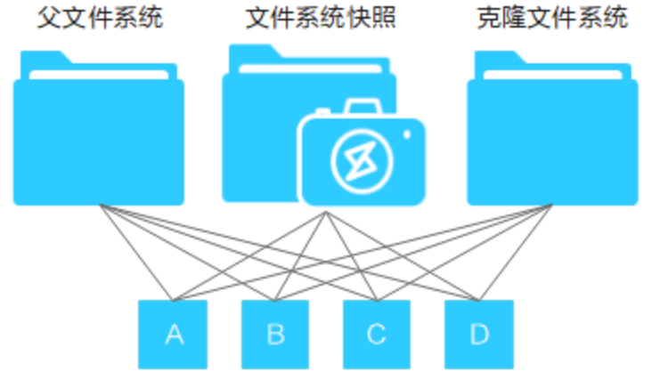
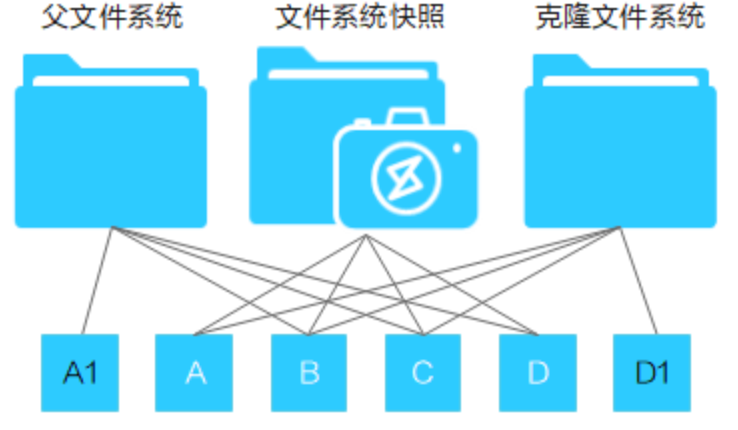
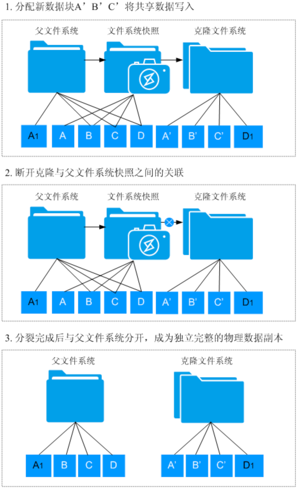

# 竞品调研

## OceanStor HyperClone

### 简介

#### 定义

文件系统克隆特性是基于文件系统或文件系统某一个时刻的快照进行创建，克隆文件系统创建完成后，该文件系统中的数据和父文件系统对应时刻点保持一致。用户可以通过对此文件系统进行读写，以达到访问克隆父文件系统对应时刻点的数据。从而使得用户可以通过创建克隆文件系统的方式，拥有一份和克隆父文件系统对应时刻点相同的数据。

#### 相关概念

1. ROW（Redirect-On-Write）技术：ROW技术是指写时重定向技术，是快照的实现技术。在写数据时，将新数据写入到新的存储位置，并将被修改数据块的指针指向新的存储位置，旧的数据作为快照数据保留或待后台回收。
2. 父文件系统：作为克隆数据源的文件系统被称作父文件系统。
3. 子文件系统：父文件系统克隆出来的文件系统被称作为子文件系统，也叫克隆文件系统。
4. 分裂：解除克隆文件系统与父文件系统之间的关联，分裂完成后，克隆文件系统成为独立完整的文件系统。

### 克隆文件系统读写原理

基于ROW技术，克隆文件系统是在文件系统快照基础上实现的文件系统在某个时间点的可读写副本。

文件系统克隆特性提供基于新建快照和基于已有快照两种创建克隆的方式。

- 基于新建快照，则克隆文件系统继承父文件系统当前时刻点的数据。
- 基于已有快照，则克隆文件系统继承父文件系统指定快照时间点的数据。

> 我们需要支持上述哪种方式？

初始创建时，数据未被修改前，克隆文件系统与父文件系统共享源数据，通过文件系统快照保证在克隆时间点的数据一致性,克隆文件系统共享给应用服务器进行读写，此时读出的数据是父文件系统的源数据。
如下图，修改数据前克隆文件系统的数据状态

当应用服务器对父文件系统或者克隆文件系统已有数据的数据块写入新数据时，由于快照ROW技术的保护，会将新数据写入新分配的存储空间，不会覆盖原有数据。如下图所示，修改父文件系统A数据块时，存储池会新分配一个A1数据块用于存储新数据，A数据块不释放；同样，修改克隆文件系统D数据块时，存储池也会新分配一个D1数据块用于存储新数据，D数据块不释放。此时，文件系统快照数据保持不变。

克隆文件系统数据访问分为以下两个场景：
-   访问在克隆文件系统上被修改过的数据时，此时克隆文件系统上的数据为最新数据，故而直接读克隆文件系统最新时间点的数据即可。
-   访问在克隆文件系统上未被修改的数据时，由于克隆父文件系统上对应时间点没有新写数据，此时通过重定向到克隆父文件系统去读取对应时间点数据。

### 克隆文件系统分裂原理
克隆文件系统分裂，会将与父文件系统共享的源数据拷贝至新分配的数据块，将共享源数据分裂，同时保留克隆文件系统新写入的数据；共享源数据分裂完成后，断开克隆与父文件系统快照之间的关联，与父文件系统分开，成为独立完整的物理数据副本。

## H3C UniStor X10000

不支持文件功能克隆，支持卷克隆

## 浪潮AS13000

不支持文件功能克隆，支持卷克隆

## ceph

支持卷克隆，底层rados支持克隆

# 竞品比较

## 概述

| 支持功能点                         | OceanStor Dorado | OceanStor V500R007 | H3C UniStor X10000 | 浪潮AS13000 |
| ---------------------------------- | ---------------- | ------------------ | ------------------ | ----------- |
| 创建/删除/查询克隆                 | ✅                | ✅                  | ❌                  | ❌           |
| 克隆分裂时删除关联的父文件系统快照 | ✅                | ✅                  | ❌                  | ❌           |
| 基于新建快照创建克隆               | ✅                | ✅                  | ❌                  | ❌           |
| 基于已有快照创建克隆               | ✅                | ✅                  | ❌                  | ❌           |
| 分裂                               | ✅                | ✅                  | ❌                  | ❌           |
| 分裂速率调整                       | ✅                | ✅                  | ❌                  | ❌           |
| 取消分裂                           | ✅                | ✅                  | ❌                  | ❌           |
| 暂停分裂                           | ✅                | ✅                  | ❌                  | ❌           |
| 支持克隆文件系统创建克隆           | 未知             | ✅                  | ❌                  | ❌           |

## 规格

| 规格项                                       | OceanStor Dorado | OceanStor V500R007 |
| -------------------------------------------- | ---------------- | ------------------ |
| 克隆文件系统创建克隆最大支持层级             | 未知             | 8                  |
| 对分裂的克隆系统创建克隆                     | ❌                | ❌                  |
| 对worm文件系统创建克隆                       | ❌                | ❌                  |
| 支持删除有子克隆文件系统的父文件系统         | 未知             | ❌                  |
| 支持删除正在执行分裂的克隆文件系统           | ❌                | ❌                  |
| 支持删除正在共享的克隆文件系统               | ❌                | ❌                  |
| 支持对有子克隆文件系统的克隆文件系统进行分裂 | 未知             | ❌                  |

# 参考资料

1. OceanStor Dorado 6.1.x HyperClone： https://support.huawei.com/enterprise/zh/doc/EDOC1100215020/426cffd9
2. OceanStor V500R007 HyperClone： https://support.huawei.com/enterprise/zh/doc/EDOC1000181466/456f4114

# 附录：
克隆文件系统与父文件系统共享源数据
场景：
克隆文件系统： （1）读取未修改数据 （2）读取修改数据 （3）修改数据
父文件系统：     （1）读取未修改数据 （2）读取修改数据 （3）修改数据
断开克隆文件系统与父文件系统涉及哪些操作？断开过程中和那些动作互斥?
克隆与快照回滚的数据差异？
克隆与数据分层的互斥？
克隆文件系统的容量显示问题？ - 克隆文件系统从父文件系统继承数据不占用克隆文件系统的容量，即克隆文件系统“已分配容量”不包含从克隆父文件系统继承数据所占用的容量。
克隆文件系统修改数据是否影响父文件系统数据？
克隆修改共享数据&非共享数据，父文件系统是否可见？
父文件系统修改共享数据&非共享数据，克隆系统是否可见？

创建克隆、删除克隆（支持删除的时机以及条件？）、查询克隆、克隆分裂
克隆分裂： 速率控制？启动分裂、取消分裂（已复制的空间如何处理？删除？）、暂停分裂；支持分裂的时机；分裂状态机
是否可以基于克隆创建克隆文件系统？
支持删除关联的父文件系统快照？

-   勾选：如果快照只被该克隆文件系统使用，快照将被删除；如果快照正在被其他特性或者其他克隆文件系统使用，快照将被保留。
-   不勾选：快照将被保留。

克隆文件系统是否可以导出？

克隆文件系统继承的父目录文件系统熟悉

克隆使用的父文件系统快照不支持删除
不支持对有子克隆文件系统的克隆文件系统进行分裂

克隆文件系统未分裂前，克隆使用的父文件系统快照不支持删除，也不支持父文件系统回滚到克隆关联快照时间点之前
克隆文件系统分裂启动后，应用服务器写入父文件系统的所有数据将不再同步至克隆文件系统中
如果分裂前对克隆文件系统创建了快照，分裂完成后，克隆文件系统的所有快照将被删除
克隆命令行
每个快照支持固定数量的克隆
tfs克隆表项和基本思路：

疑问点

1. 对于基于新建快照和基于已有快照两种克隆方式，我们需要支持哪种？
2. 克隆继承父目录文件系统哪些属性？
   1. 已有快照？存储池？layout？配额?Qos？数据分层策略？worm？快照回滚？

1. rename && link支持？
1. 远程复制pair相关？