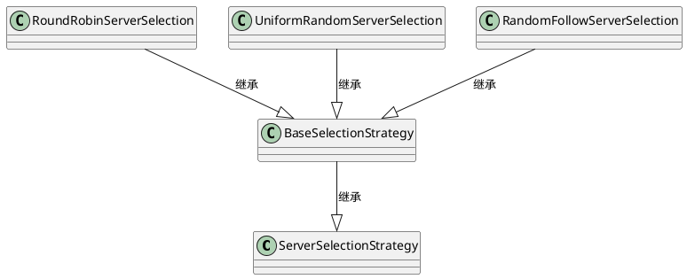
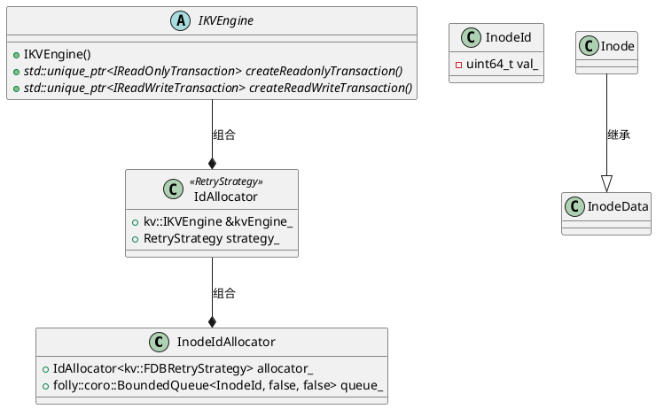
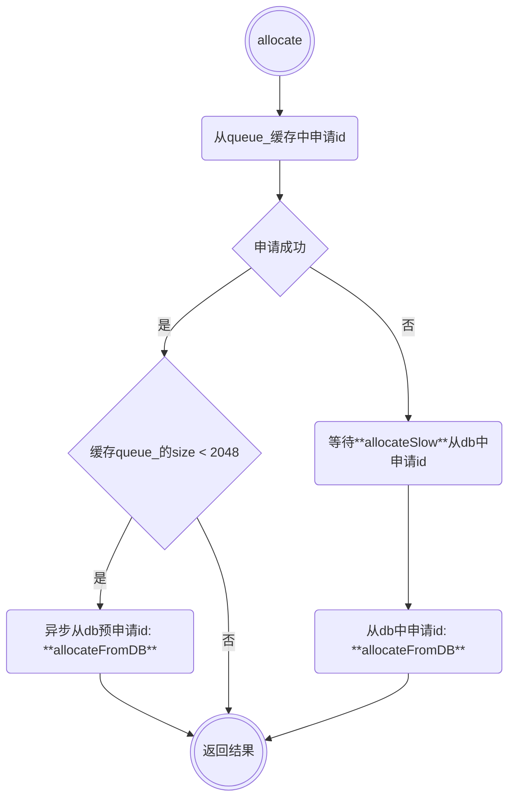
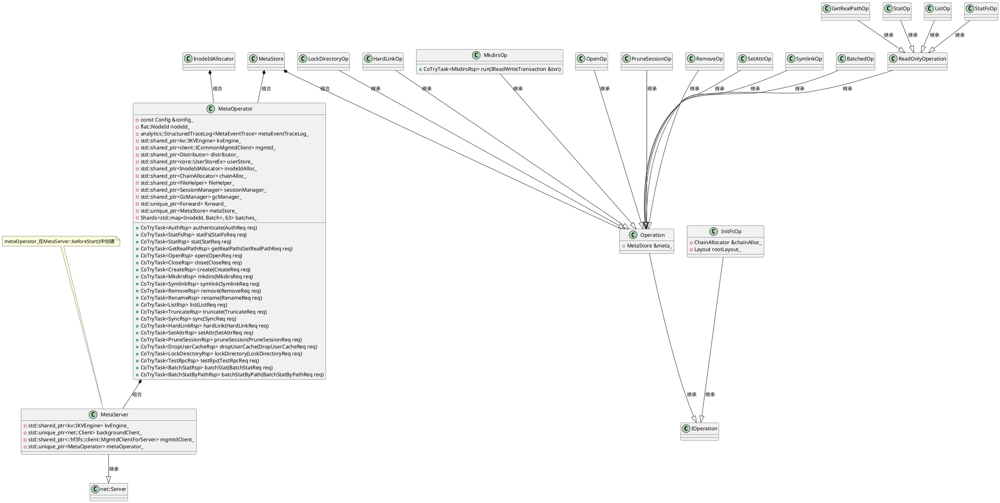
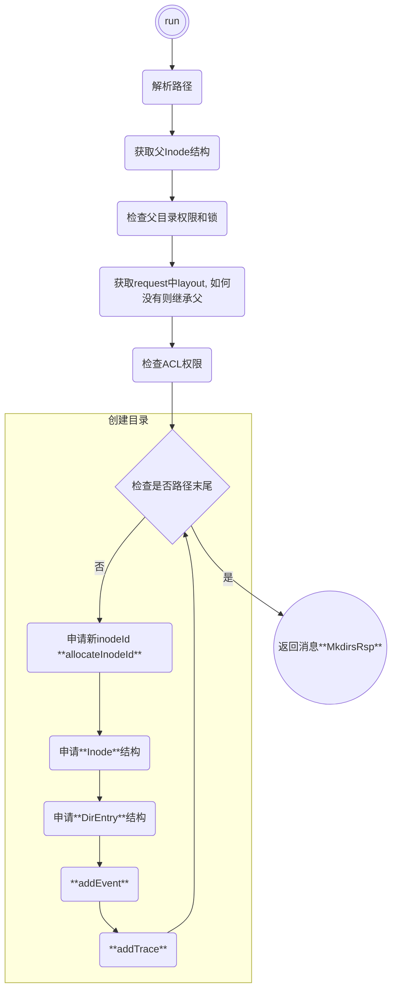

---
状态:
  - 完成
年份:
  - "2025"
tags:
  - 技术学习
  - 技术调研
  - 3FS
imageNameKey: 3FS
---
# 1 整体架构

3FS 的整体架构由 Cluster Manager、Client、Meta Service 和 Storage Service 四部分组成。所有组件均接入 RDMA 网络实现高速互联，DeepSeek 内部实际使用的是 InfiniBand。
- **Cluster Manager** 是整个集群的中控，承担节点管理的职责
    - Cluster Manager 采用多节点热备的方式解决自身的高可用问题，选主机制复用 Meta Service 依赖的 FoundationDB 实现；
    - Meta Service 和 Storage Service 的所有节点，均通过周期性心跳机制维持在线状态，一旦这些节点状态有变化，由 Cluster Manager 负责通知到整个集群；
    - Client 同样通过心跳向 Cluster Manager 汇报在线状态，如果失联，由 Cluster Manager 帮助回收该 Client 上的文件写打开状态。
- **Client** 提供两种客户端接入方案
    - FUSE 客户端 hf3fs_fuse 方便易用，提供了对常见 POSIX 接口的支持
    - 原生客户端 USRBIO 提供的是 SDK 接入方式，应用需要改造代码才能使用，但性能相比 FUSE 客户端可提升 3-5 倍。
- **Meta Service** 提供元数据服务，采用存算分离设计
    - 元数据持久化存储到 FoundationDB 中，FoundationDB 同时提供事务机制支撑上层实现文件系统目录树语义；
    - Meta Service 的节点本身是无状态、可横向扩展的，负责将 POSIX 定义的目录树操作翻译成 FoundationDB 的读写事务来执行。
- **Storage Service** 提供数据存储服务，采用存算一体设计：
    - 每个存储节点管理本地 SSD 存储资源，提供读写能力；
    - 每份数据 3 副本存储，采用的链式复制协议 CRAQ（Chain Replication with Apportioned Queries）提供 write-all-read-any 语义，对读更友好；
    - 系统将数据进行分块，尽可能打散到多个节点的 SSD 上进行数据和负载均摊。

![[【01】技术系统/【01】通用技术/文件系统/3FS/assets/IMG-2025-03-25-08.png|325]]
# 2 Meta Service
Meta Service 负责存储和管理文件系统的元数据采用存算分离的设计理念，将元数据持久化存储于 FoundationDB（分布式的、支持 SSI 隔离级别事务） 中，同时利用 FoundationDB 提供的事务机制实现文件系统目录树语义（所有事务是一个一个按序执行的，而**每一个目录树操作都基于事务做，自然就是等价于每个目录树操作都是等价于串行化运行的**，自然不存在任何一致性问题）。

3FS的元数据架构将元数据构建在高性能KV存储系统， 并在此基础之上其将文件系统元数据分解为 inode 和目录条目（directory entries）两种核心结构，然后通过事务化的键值存储实现高效的Posix操作。

FoundationDB的乐观事务模型在事务冲突场景下性能会衰退的比较厉害，3FS在schema上有针对Inode和Dentry作了分离的设计
1. 让同一目录下的Dentry聚集在一起，这样减少readdir的交互
2. Inode id小端存储， 利用inode id连续分配和FoundationDB的range分片特性，将inode打散在不同节点

3FS MetaServer将Meta请求会按照多种随机策略将请求转发到不同的MetaServer上，MetaServer再将Posix语义转换为KV事务请求下发到FoundationDB。整个请求路径上端到端没有任何缓存而是采用及其简单的事务配合以coroutine调度来满足高吞吐，与此同时MetaServer内部内置了多个组件配合保证Posix语义在事务场景下的高效运转。

- **MetaOperation**: 具体Posix请求的解析和处理
- **Forward & BatchOp**: 将部分高频可合并的写请求转发到对应的节点并Batch执行
- **InodeAllocator**: InodeID分配器
- **Session**: 在分布式场景下，维护文件open状态
- **ChainAllocator**: 文件数据Layout所依赖Chain分配器
- **GC**：垃圾回收
- **KVEngine**: KV引擎

![[【01】技术系统/【01】通用技术/文件系统/3FS/assets/IMG-2025-03-25-08-1.png|400]]


# 3 元数据管理
几种经典的元数据管理方式：
- 静态子树：将文件目录树划分成不同的子树，不同子树固定到不同的metanode托管
- hash分区： 通过file或者dir将文件系统的元数据通过hash算法映射到不同的元数据节点MDS
- 动态子树：mds的负载情况动态的调整目录子树到不同的mds
- 基于分布式数据库：利用分布式数据库海量数据存储能力，将文件系统的层级元数据转化成扁平的数据结构存储到数据库，同时利用数据库的事务保障元数据操作的原子性

|              | 优点            | 不足                                    |
| ------------ | ------------- | ------------------------------------- |
| **静态子树**     | 解决了扩展性问题      | 较容易出现热点数据，需要运维将热点目录拆分，运维成本高           |
| **hash分区**   | 避免了数据热点       | 在扩展节点时，会面临元数据的重映射，存在元数据的迁移，影响业务使用     |
| **动态子树**     | 理论上扩展性和性能是比较好 | 热点数据比较分散，mds经常性的动态迁移从而影响到性能           |
| **基于分布式数据库** | 很好的解决扩展性问题    | 避免不了额外的运营成本，对于低延迟的业务场景还可能针对性的优化分布式数据库 |

|           | HDFS | tfs    | CephFs | JuiceFs  | CubeFS           | 3FS      | 杉岩              |
| --------- | ---- | ------ | ------ | -------- | ---------------- | -------- | --------------- |
| **元数据管理** | 静态子树 | hash分区 | 动态子树   | 基于分布式数据库 | 基于inode id进行范围分区 | 基于分布式数据库 | 自研分布式数据库AgileDB |
## 3.1 元数据模型

### 3.1.1 inode和dentry组织方式
Metadata Service 采用 inode 和 dentry 分离的设计思路，两种结构的主键分别采用不同的前缀从而模拟出两种不同的数据模型。

| Table name   | key                                   | value                                             | 说明                                                                                                                                                                                                        |
| ------------ | ------------------------------------- | ------------------------------------------------- | --------------------------------------------------------------------------------------------------------------------------------------------------------------------------------------------------------- |
| Dentry Table | "DENT" + parent inode_id + entry name | parent_id, name, inode_type, dirAcl, uuid, gcInfo | Inode和Dentry编码到两张逻辑表，且FoundationDB按Range分片[^1]，全局有序，从而将不同类型数据从物理上隔离，对Readdir场景遍历dentry友好<br><br>Dentry Table的key把父inode id作为前缀，同一目录下dentry在物理上连续放置，Readdir请求可以通过Scan连续读取<br>                              |
| Inode Table  | "INOD" + inode_id                     | 基本属性 + 附加属性                                       | Inode id小端存储[^2]， 利用inode id连续分配，以及FoundationDB全局有序特性，可以将inode散列在不同的数据分片上，GetAttr请求集群内分布跟均衡，提升系统吞出<br><br>同一文件的inode和dentry未做数据亲和处理，dentry和inode可能落在不同的FoundationDB不同的数据分片上，Lookup时需要跨分片读取一次inode<br><br> |

### 3.1.2 举例
每个文件或者目录目录会抽象为两条数据，比如下图中的/home/file1在KV视图中对应了第二条Dentry和第三条Inode.

**FS视图**：
```bash
/
|--home
|  |--file1
|  |--file2
|  |--file3
```

**KV视图**：

| Dentry Table                           |
| -------------------------------------- |
| (DENT,0,"home")-> (inodeid:2, other)   |
| (DENT,2,"file1")-> (inodeid:3,  other) |
| (DENT,2,"file2")-> (inodeid:4,  other) |
| (DENT,2,"file3")-> (inodeid:5,  other) |

| Inode Table                        |
| ---------------------------------- |
| (INOD,0)-> (type:Directory, other) |
| (INOD,2)-> (type:Directory, other) |
| (INOD,3)-> (type:File, other)      |
| (INOD,4)-> (type:File, other)      |
| (INOD,5)-> (type:File, other)      |
采用这种数据模型的目的便是是为了支持目录树层级结构上以下几种读写模式:
1. 点查询模式
    - 路径查找+Inode属性查找: 两种查找都可以转换为对应的Prefix Key上的点读：
        1. /home/file1的Path Resolve流程，既是在DentryTable依次查找出(DENT,0,"home")和（DENT,2,"file1"）
        2. home/file1的Getattr流程，既是在Inode Table出查找(INOD,3)
2. 范围查询
    - Readdir查询可以转换为基于DENT+父目录InodeID的范围查询，/home目录下的list既在Dentry Table中以DENT+2为Prefix进行范围查询
3. 写事务：一条或多条记录的写事务
### 3.1.3 模型劣势和弥补措施

1. 每个节点都承载一定数量的分片，跨分片更新多个key的数据时涉及的事务操作开销较大
    - Metadata key的布局特点决定了文件系统的create、rename等常见更新类操作，若严格按照标准POSIX协议实现，在FoundationDB侧等同于一个事务中更新多个key的操作。如果多个key被分配到KVDB集群的不同分片上，为保证事务操作的原子性会触发两阶段提交（2PC），相比单个key或者多个key落在同一个分片上的情况（可简化为1PC提交），时延明显增加。
    - 3FS在实现上为减少事务冲突，选择在文件创建时不更新父目录属性，以牺牲通用文件POSIX语义来换取特定场景下的性能
2. 由于FoundationDB采用串行化快照事务隔离级别（SSI），这种高隔离级别的事务开销较大，事务冲突场景下性能衰退严重。当两个并行的元数据更新操作发生冲突时，KVDB层检测到事务冲突后会导致一个事务被取消，之后在IO路径上触发Meta Service层的重试事务，可能影响吞吐量。另外，通用文件系统里更复杂的操作（如递归删除目录），会涉及大量事务提交，性能影响更大
    - 3FS采用支持非空目录删除与标记删除来尽力规避这种问题，以牺牲通用文件POSIX语义来换取特定场景下的性能
3. SSI的串行化隔离级别在KVDB的实现上依赖一个全局的单点TSO时钟，这会成为扩展的瓶颈， 在大规模集群场景下，整个文件系统的并发能力的上限受到限制，并且TSO时钟本身的授时开销也会增加元数据访问的时延。
    - 3FS通过FFrecord文件来规避这个问题，通过在应用层将小文件合并成大文件，保存在FoundationDB中的元数据量可以大幅减少
## 3.2 文件布局
### 3.2.1 简要描述
数据采用链式复制协议 CRAQ（Chain Replication with Apportioned Queries - **链式复制与分摊查询**），基本原理：
- **链式复制基础**：节点按顺序组成链，如 “Head → Node1 → Node2 → Tail”。写操作从链头（Head）进入，依次传递到链尾（Tail），所有节点确认后写操作完成。传统链式复制通常由链尾（Tail）负责响应读请求，以保证读取最新数据，但这也会使其成为性能瓶颈。
- **分割查询（Apportioned Queries）**：允许链中的任意节点处理读请求，而不仅限于链尾。每个节点维护数据的多个版本，并记录最新的已提交版本和未提交版本。通过版本号或时间戳机制，确保节点仅返回已全局提交的数据。

3FS中多条链组成 chain table，存放在元数据节点，Client 和数据节点通过心跳，从元数据节点获取 chain table 并缓存。一个集群可有多个 chain table

一个文件在创建时，会按照父目录配置的 layout 规则，包括 chain table 以及 stripe size（**一个文件存放在一个chain table中**），从对应的 chain table中选择多个 chain 来存储和并行写入文件数据。chain range 的信息会记录到 inode 元数据中，包括起始 chain id 以及 seed 信息（用来做随机打散）等。在这个基础之上，文件数据被进一步按照父目录 layout 中配置的 chunk size 均分成固定大小的 chunk（官方推荐 64KB、512KB、4MB 3 个设置，默认 512KB），每个 chunk 根据 index 被分配到文件的一个 chain上。

访问数据时用户只需要访问 Meta Service 一次获得 chain 信息和文件长度，之后根据读写的字节范围就可以计算出由哪些 chain 进行处理。

### 3.2.2 chain分配算法 - ChainAllocator
在src/meta/components/ChainAllocator.h中，通过类ChainAllocator实现
```c++
class ChainAllocator {
    CoTryTask<void> allocateChainsForLayout(...);  //分配对应的chain

    using AllocType = std::pair<flat::ChainTableId, size_t>;
    folly::Synchronized<std::map<AllocType, uint32_t>, std::mutex> roundRobin_; //
}
```

1. 根据入参layout中的tableId和tableVersion从mgmtdClient_中获取ChainTable（使用table变量保存）
2. 根据ChainTable中ChainCnt计算layout中ChainRange的起始index
    1. allocateChainsForLayout(Layout &layout)：
        1. 
3. 更新layout的tableVersion字段
    - `layout.tableVersion = table->chainTableVersion`
4. 更新layout的chains字段: 
    - `Layout::ChainRange(chainBegin, Layout::ChainRange::STD_SHUFFLE_MT19937, folly::Random::rand64()`
    - 在Layout::ChainRange::getChainIndexList(size_t stripe)中使用

### 3.2.3 客户端layout使用方式

### 3.2.4 数据结构和类图

```c++
//src/fbs/meta/Schema.h
struct Layout {
    struct Empty { ... }
    struct ChainRange {
        ChainRange() = default;
        ChainRange(uint32_t baseIndex, Shuffle shuffle, uint64_t seed)
            : baseIndex(baseIndex),
              shuffle(shuffle),
              seed(seed),
              chains() {}
        ChainRange(const ChainRange &o)
            : ChainRange(o.baseIndex, o.shuffle, o.seed) {}

        Layout::ChainRange::getChainIndexList(size_t stripe)//对std::vector<uint32_t> chains(stripe)，生成随机数填充chain并重排元素
            
        enum Shuffle : uint8_t { NO_SHUFFLE = 0, STD_SHUFFLE_MT19937 };
        uint32_t baseIndex = 0;
        Shuffle Shuffle = 0;
        uint64_t seed = 0;
        mutable folly::DelayedInit<std::vector<uint32_t>> chains;
    }
    struct ChainList {
        std::vector<uint32_t> chainIndexes;
    }

    class ChunkSize {
        uint32_t val_;
    }

    ChainTableId tableId; //uint32_t, 存储链对应TableID
    ChainTableVersion tableVersion; //uint32_t, 条带参数，影响数据在Chain上的分布
    ChunkSize chunkSize; //固定Chunk大小
    uint32_t stripeSize; //固定stripe Size
    std::variant<Empty, ChainRange, ChainList> chains; //Chain的集合，目前支持Empty、ChainRange、ChainList三种
}

```
3FS将文件按照固定大小切到不同的Chunk，这些Chunk同时会按照Stripe Size散在一堆Chain集合中。
以上Layout元数据信息都是**静态信息，在文件创建时生成**，这样在IO路径不需要额外访问元数据服务，只需要根据读写的Range计算出ChunkID并根据Layout算出对应的Chain即可。

## 3.3 元数据分区管理

选择server node
在某个地方存在初始化选择策略的地方
哪些节点可以作为server？client如何与server建立连接


```c++
//src/client/meta/MetaClient.cc

CoTryTask<MetaClient::ServerNode> MetaClient::getServerNode() {
    //使用ServerSelectionStrategy类提供的接口选择server
}

//src/client/meta/ServerSelectionStratergy.cc

三种选择方式：
1. RoundRobin: 节点轮询方式
2. UniformRandom: 随机分布方式
3. RandomFollow: 指定节点集合随机
```




## 3.4 Inode分配机制
InodeID将uint64的值区间拆分成两个区间：
- 高52位：从全局ID分配器（DB）申请获取(`class InodeIdAllocator`)
- 低12位：本地负责分配

同时本地InodeID分配器在本地InodeID不足的情况下提前去DB分配高位InodeID。
### 3.4.1 类图和函数
```c++
// src/fbs/meta/Schema.h
struct InodeData {

}

// src/fbs/meta/Schema.h
struct Inode : InodeData {

}

// src/fbs/meta/Common.h
class InodeId {
private:
    uint64_t val_;
}

// src/common/util/IdAllocator.h
template <typename RetryStrategy>
class IdAllocator {
public:
    CoTryTask<uint64_t> allocate(...)
    
    kv::IKVEngine &kvEngine_; //抽象的数据库引擎
    RetryStrategy strategy_;  //申请失败的重试策略
    
    String keyPrefix_; 
    uint8_t numShard_;
    std::atomic<size_t> shardIdx_;
    std::vector<uint8_t> shardList_; //根据numShard_初始化
}

// src/meta/components/InodeAllcator.h
/* 
* Generate InodeId range from 0x00000000_00001000 to 0x01ffffff_ffffffff.
* Generated InodeId format: [ high 52bits: generated by IdAllocator ][ low 12 bits: local generated ].
* InodeIdAllocator first use IdAllocator to generate a 52bits value, then left shift 12 bits and generate lower 12 bits
* locally. So it only need to access the FoundationDB after generate 4096 InodeIds.
*/
class InodeIdAllocator {
public:
    static constexpr size_t kAllocatorShard = 32;    // avoid txn conflictation
    static constexpr uint64_t kAllocatorShift = 12;  // 低12bit
    static constexpr uint64_t kAllocatorBit = 64 - kAllocatorShift;  // 高52bit
    static constexpr uint64_t kAllocatorMask = (1ULL << kAllocatorBit) - 1; // 52bit全1
    static constexpr uint64_t kAllocateBatch = 1 << kAllocatorShift; //4096
  
    CoTryTask<InodeId> allocate(...); //申请inode接口

    std::shared_ptr<kv::IKVEngine> engine_;  //KV Engine
    // 在构造函数中初始化allocator_，设置keyPrefix_为空，numShard_为32
    IdAllocator<kv::FDBRetryStrategy> allocator_;
    folly::coro::BoundedQueue<InodeId, false, false> queue_;
    
}
```



### 3.4.2 申请inode算法
InodeIdAllocator-> allocate()-> allocateFromDB() 使用类IdAllocator->allocate()生成高52bit的值，然后从本地申请低12bit的值，简要流程如下：


allocateFromDB的申请逻辑：
1. IdAllocator-> allocate()-> allocateTxn()，从数据库申请得到ID
    1. 递增shardIdx_，将shardIdx_对shardList_.size()取模选择对应的shard，即轮询shard分配
    2. 获取shardKey, 格式为"keyPrefix-shard"，从数据库中获取当前分片的计数值val，然后val += 1，转换为小端序，并写入数据库
    3. 新ID的计算公式是：(val * numShard_) + shard， 其中numShard_是分片总数，shard是当前分片的索引，这种计算方式可以确保不同分片生成的ID是唯一的。
        - 举例：如果有32个分片(numShard_=32)，分片0的ID序列是：0，32，64，128，...，分片1的ID序列是：1，33，65，129...
        - 比如对于分片0，上次val计数为0，则分配的ID是0，本次val +=1，则val = 1，分配的ID是32。
2. 对申请得到的ID << kAllocatorShift, 左移12位，低12位本次申请id，存储到缓存队列中
```c++
auto first = result.value() << kAllocatorShift; //result << 12
for (uint64_t i = 0; i < kAllocateBatch; i++) { // for (uint64_t i = 0; i < 4096; i++) {
    meta::InodeId id(first + i);
    co_await queue_.enqueue(id);
}
```


## 3.5 元数据操作-MetaOperation

```c++
// src/meta/store/MetaStore.h
template <typename Rsp>
class IOperation {
    virtual bool isReadOnly() = 0;
    virtual bool retryMaybeCommitted() { return true; }
    virtual CoTryTask<Rsp> run(IReadWriteTransaction &) = 0;
    virtual void retry(const Status &) = 0;
    virtual void finish(const Result<Rsp> &) = 0;
    CoTryTask<Rsp> operator()(IReadWriteTransaction &txn) { co_return co_await run(txn); }
}

// src/meta/store/Operation.h
template <typename Rsp>
class Operation : public IOperation<Rsp> {
    Operation(MetaStore &meta) : meta_(meta) {}

    PathResolveOp resolve();
    CoTryTask<InodeId> allocateInodeId();

    MetaStore &meta_;
}

// src/meta/store/MetaStore.h
class MetaStore {
    template <typename Rsp>
    using Op = IOperation<Rsp>;

    template <typename Rsp>
    using OpPtr = std::unique_ptr<IOperation<Rsp>>;

    static OpPtr<Void> initFileSystem(ChainAllocator &chainAlloc, Layout rootLayout); //初始化文件系统
    OpPtr<Void> initFs(Layout rootLayout); // initFs->initFileSystem()
    OpPtr<StatFsRsp> statFs(const StatFsReq &req);
    OpPtr<StatRsp> stat(const StatReq &req);
    OpPtr<BatchStatRsp> batchStat(const BatchStatReq &req);
    OpPtr<BatchStatByPathRsp> batchStatByPath(const BatchStatByPathReq &req);
    OpPtr<GetRealPathRsp> getRealPath(const GetRealPathReq &req);
    OpPtr<OpenRsp> open(OpenReq &req);
    OpPtr<CreateRsp> tryOpen(CreateReq &req);
    OpPtr<MkdirsRsp> mkdirs(const MkdirsReq &req);
    OpPtr<SymlinkRsp> symlink(const SymlinkReq &req);
    OpPtr<RemoveRsp> remove(const RemoveReq &req);
    OpPtr<RenameRsp> rename(const RenameReq &req);
    OpPtr<ListRsp> list(const ListReq &req);
    OpPtr<SyncRsp> sync(const SyncReq &req);
    OpPtr<HardLinkRsp> hardLink(const HardLinkReq &req);
    OpPtr<SetAttrRsp> setAttr(const SetAttrReq &req);
    OpPtr<PruneSessionRsp> pruneSession(const PruneSessionReq &req);
    OpPtr<TestRpcRsp> testRpc(const TestRpcReq &req);
    OpPtr<LockDirectoryRsp> lockDirectory(const LockDirectoryReq &req);
}

// src/meta/service/MetaOperator.h
class MetaOperator {
    CoTryTask<void> init(std::optional<Layout> rootLayout);

public:
    void start(CPUExecutorGroup &exec);
    void beforeStop();
    void afterStop();
    
    CoTryTask<AuthRsp> authenticate(AuthReq req);
    CoTryTask<StatFsRsp> statFs(StatFsReq req);
    CoTryTask<StatRsp> stat(StatReq req);
    CoTryTask<GetRealPathRsp> getRealPath(GetRealPathReq req);
    CoTryTask<OpenRsp> open(OpenReq req);
    CoTryTask<CloseRsp> close(CloseReq req);
    CoTryTask<CreateRsp> create(CreateReq req);
    CoTryTask<MkdirsRsp> mkdirs(MkdirsReq req);
    CoTryTask<SymlinkRsp> symlink(SymlinkReq req);
    CoTryTask<RemoveRsp> remove(RemoveReq req);
    CoTryTask<RenameRsp> rename(RenameReq req);
    CoTryTask<ListRsp> list(ListReq req);
    CoTryTask<TruncateRsp> truncate(TruncateReq req);
    CoTryTask<SyncRsp> sync(SyncReq req);
    CoTryTask<HardLinkRsp> hardLink(HardLinkReq req);
    CoTryTask<SetAttrRsp> setAttr(SetAttrReq req);
    CoTryTask<PruneSessionRsp> pruneSession(PruneSessionReq req);
    CoTryTask<DropUserCacheRsp> dropUserCache(DropUserCacheReq req);
    CoTryTask<LockDirectoryRsp> lockDirectory(LockDirectoryReq req);
    CoTryTask<TestRpcRsp> testRpc(TestRpcReq req);
    CoTryTask<BatchStatRsp> batchStat(BatchStatReq req);
    CoTryTask<BatchStatByPathRsp> batchStatByPath(BatchStatByPathReq req);

private:
    const Config &config_;
    flat::NodeId nodeId_;
    analytics::StructuredTraceLog<MetaEventTrace> metaEventTraceLog_;
    std::shared_ptr<kv::IKVEngine> kvEngine_;
    std::shared_ptr<client::ICommonMgmtdClient> mgmtd_;
    std::shared_ptr<Distributor> distributor_;
    std::shared_ptr<core::UserStoreEx> userStore_;
    std::shared_ptr<InodeIdAllocator> inodeIdAlloc_;
    std::shared_ptr<ChainAllocator> chainAlloc_;
    std::shared_ptr<FileHelper> fileHelper_;
    std::shared_ptr<SessionManager> sessionManager_;
    std::shared_ptr<GcManager> gcManager_;
    std::unique_ptr<Forward> forward_;
    std::unique_ptr<MetaStore> metaStore_;
    Shards<std::map<InodeId, Batch>, 63> batches_;
}

// src/fbs/meta/Service.h
struct RspBase {}
```


代码路径： `src/meta/store/ops`  



### 3.5.1 create
1. 客户端发送create请求：`MetaClient::create()`
    - Stub: `IMPL_META_STUB_METHOD(create, CreateReq, CreateRsp);`
2. Meta Server相应处理: `MetaOperator::create()`-> 
    - 获取父目录所在的服务器节点作为目标节点
        1. 如果当前节点就是目标节点，调用`MetaOperator::runInBatch()`在本地处理创建请求
        2. 如果目标节点是其他节点，调用`Forward::forward()`将请求转发到目标节点处理
3. Meta Server创建文件: `BatchedOp::create()`
    - `ChainAllocator::allocateChainsForLayout()`
    - `allocateInodeId()`
    - `DirEntry::newFile()`
    - `Inode::newFile()`
    - `co_return std::make_pair(inode, entry)`
    
### 3.5.2 mkdirs
#### 3.5.2.1 meta server内部逻辑
下面以mkdir为例描述Meta Operation: `src/meta/store/ops/Mkdirs.cc`, mkdir支持创建路径所有目录，比如传入创建A/B/C，则A B C全部创建
1. 客户端发送mkdirs请求：`MetaClient::mkdirs()`
    - Stub: `IMPL_META_STUB_METHOD(mkdirs, MkdirsReq, MkdirsRsp); //src/stubs/MetaService/MetaServiceStub.cc`
2. Meta Server相应处理: `MetaOperator::mkdirs()`-> `MetaStore::mkdirs()`
    - Service: `META_SERVICE_METHOD(mkdirs, MkdirsReq, MkdirsRsp);`

```c++
class MkdirsOp : public Operation<MkdirsRsp> {
public:
    CoTryTask<MkdirsRsp> run(IReadWriteTransaction &txn) override {
        ...
    }

private:
  const MkdirsReq &req_;
}
```



#### 3.5.2.2 client-> mds->DB


## 3.6 事务模型
在KV的put/get以及RangeQuery基础上，3FS为所有的元数据服务提供了两种Transaction模型抽象：
- **IReadOnlyTransaction**: 类似一种SI隔离级别的只读事务模型，为Get和RangeQuery提供快照语义，用来支持大多数只读Operation(如Stat、list等)，
- **IReadWriteTransaction**: 类似一种SSI隔离级别的读写事务模型，提供了AddReadConflict和AddReadConflictRange接口，从而保证上层复杂Posix语义（如remove、rename）的安全性
    
此外3FS对事务模型做了一层抽象并于底层**KV Engine**解耦，所以3FS可以接入除FoudationDB外其他引擎。

### 3.6.1 事务优化
事务是所有3FS内所有Posix请求执行的内核，所以高效的事务对于其元数据服务性能至关重要，为了让事务的处理在Meta服务中更加高效，让3FS在AI场景下有更好的效果，3FS在很多环节对事务也做了优化：
#### 3.6.1.1 异步化+协程化
首先在FDB的IO路径上采用完全异步化实现，其将FDBFuture与3FS的元数据服务基于folly coroutine框架结合，将所有事务异步读写CallBack转换成coroutine里的Task，从而提升MetaService整体的吞吐和CPU利用率

```c++
// src/common/util/Coroutine.h
```
#### 3.6.1.2 Batch处理

然后在MetaOperator层，3FS对一些高频且可合并的写事务做了**Forward**和**Batch**处理:
- 将不同Inode上的写请求的处理按照InodeID转发到对应的Node上(**这里依赖Distributer组件**)
- 同一个Meta Node下按照InodeID的Hash散到不同的BatchOP上，同一个Hash分片上的BatchOP采用队列组织，每完成一个Batch事务会唤醒下一个    
- 同一个Inode上的写请求在BatchOP采用一个共同的Transaction并在本地做合并，比如多个Setattr可以在内存里Apply完最后一把提交

目前支持Batch化处理的请求包括Sync、SetAttr、Create、Close。基于以上优化不仅仅可以提升系统整体的吞吐，而且可以极大的降低FoundationDB侧事务冲突的概率。

## 3.7 Session

## 3.8 GC

## 3.9 KVEngine

## 3.10 元数据均衡

## 3.11 元数据一致性

# 4 MDS高可用 - 故障切换

# 5 MDS扩缩容

# 6 分布式数据库
## 6.1 DB对比

|            | FoundationDB                        | TiKV/TiDB                       | RocksDB+rbd                    |
| ---------- | ----------------------------------- | ------------------------------- | ------------------------------ |
| 支持分布式事务    | 支持                                  | 支持                              | 支持自研                           |
| 并发控制策略     | MVCC[^3]（融合了部分OCC[^4]冲突检测逻辑）        | MVCC，多版本导致海量文件场景元数据占用过多         | 多版本并发控制（MVCC）                  |
| 事务隔离级别     | 串行化快照隔离级别（SSI）[^5]                  | 串行化快照隔离级别（SSI）                  | 事务隔离级别[^6]                     |
| 事务时钟       | 全局TSO                               | 全局TSO，依赖中心节点性能和可用性              | 使用全局的 “Ceph 时间戳” 机制来实现节点间的时间同步 |
| 多副本复制协议    | 基于日志的私有复制协议                         | Multi-Raft                      | Paxos                          |
| 协处理能力[^7]  | 不支持                                 | 支持，可以将TIDB或者其他调用方的计算操作下推到TiKV节点 | 不支持                            |
| 多列族        | 不支持                                 | 不支持，可以通过TiDB支持，只是失去KV接口的灵活性     | 支持                             |
| 维护和二次开发门槛  | 高                                   | 高                               | 低                              |
| 数据节点对等[^8] | 节点对等                                | 无要求[^9]                         | 无要求                            |
| 数据一致性粒度    | 事务级                                 | region-level[^10]                | 事务级                            |
| 管理节点       | fdbserver[^11]，和数据节点可以部署相同节点，也可以独立部署 | PD（单独的server）                   | monitor service                |
| 数据节点       | fdbserver                           | TiVK server（单独存储介质存数据）          | osd service                    |
| 内存缓存磁盘数据量  | 一部分                                 | 一部分                             | 一部分                            |
| 适配ceph情况   | 存在两套集群管理和存储层，运维难度高                  | 存在两套集群管理和存储层，运维难度高              | 复用现有ceph集群管理和数据存储，维护简单         |
| 事务开销       | 跨分片事务开销较大                           | 跨分片事务开销较大                       | 跨rank事务开销较大                    |
| 横向扩展       | 全局的单点TSO时钟对中心节点依靠较大，同时会增加授权开销       | 全局的单点TSO时钟对中心节点依靠较大，同时会增加授权开销   | 无影响                            |

DXN采用ceph架构，ceph自身提供rbd和集群管理，利用一套底层存储就可以提供所有上层业务；
如果接入分布式数据库则存在两套集群管理，同样store层也需要两套，难以维护

|           | 3FS(FoundationDB)             | TFS(RocksDB+rbd)                                   |
| --------- | ----------------------------- | -------------------------------------------------- |
| 支持分布式事务   | 支持                            | 支持（自研）                                             |
| mds并发     | 支持                            | 支持                                                 |
| 分片粒度      | inode完全打散，dentry和父目录有亲和性      | 目录inode完全打散，文件inode与父目录inode在相同rank，dentry与父目录强亲和性 |
| 维护和二次开发门槛 | 低                             | 高                                                  |
| 数据一致性方式   | 全局唯一时间戳、两阶段提交                 | 分布式锁、两阶段提交                                         |
| 管理节点一致性协议 | 基于日志的私有复制协议                   | Paxos                                              |
| 横向扩展      | 全局的单点TSO时钟对中心节点依靠较大，同时会增加授权开销 | 无影响                                                |
| 容量均衡      | 均衡性较好                         | 均衡性与场景有关                                           |
| inode空间   | 64位                           | 64位                                                |
| 租户隔离      | 不支持                           | 不支持                                                |
| 分布式锁类型    | 无分布式锁                         | 文件级                                                |
| Posix     | 有限支持                          | 支持                                                 |

# 7 3FS vs TFS


|         | 3FS                                            | TFS                                 |
| ------- | ---------------------------------------------- | ----------------------------------- |
| 分布式一致性  | FoundationDb                                   | ceph rbd                            |
| 分布式事务   | FoundationDb                                   | 自研                                  |
| 服务架构    | 依赖FoundationDb提供多节点服务                          | 按照rank哈希将访问分布在多节点，通过rank            |
| 元数据分片   | 依赖FoundationDB Range分片特性将inode和dentry分布在不同物理节点 | 目录按照rank哈希方式，将inode的dentry打散在不同物理节点 |
| 多客户端一致性 | 无缓存，直接读取FoundationDb                           | 分布式锁                                |

# 8 3FS over Foundationdb

3FS 使用分布式的、支持 SSI[^12] 隔离级别事务(和 2PL 实现的一样，都是可串行化的隔离级别)的数据库 FoundationDB。

**等价于所有事务是一个一个按序执行的**，**而每一个目录树操作都基于事务做，自然就是等价于每个目录树操作都是等价于串行化运行的**，自然不存在任何一致性问题

3FS之所以选择FoundationDB是因为其支持SSI的**事务隔离级同时又支持简单高效的KV接口**。

只读事务用于元数据查询：`fstat`、`lookup`、`listdir`等
读写事务用于元数据更新：`create`、`link`、`unlink`、`rename`等

所有的一致性复杂性都交给 FoundationDB 解决，将可靠性、扩展性等分布式系统通用能力下沉到分布式 KV 存储，Meta Service 节点只是充当文件存储元数据的 Proxy，负责语义解析

利用 FoundationDB SSI 隔离级别的事务能力，目录树操作串行化，冲突处理、一致性问题等都交由 FoundationDB 解决。Meta Service 只用在事务内实现元数据操作语义到 KV 操作的转换


# 9 Debug方式


# 10 参考
- https://github.com/deepseek-ai/3FS/blob/main/docs/design_notes.md
- [DeepSeek 3FS 架构分析和思考（上篇）](https://mp.weixin.qq.com/s/X60PsEPeFsb-ZPKATMrWrA)
- [DeepSeek 3FS：端到端无缓存的存储新范式](https://mp.weixin.qq.com/s/YuDrT5Fn2kYnW-taC6OWOw)
- [JuiceFS 元数据引擎初探：高层架构、引擎选型、读写工作流](https://arthurchiao.art/blog/juicefs-metadata-deep-dive-1-zh/#2-juicefs-%E5%85%83%E6%95%B0%E6%8D%AE%E5%AD%98%E5%82%A8%E5%BC%95%E6%93%8E%E5%AF%B9%E6%AF%94tikv-vs-etcd)
- [CubeFS存储技术揭秘-元数据管理](https://mp.weixin.qq.com/s/_PwSANyJZZuFst1SOolNGQ)
- [DeepSeek 3FS解读与源码分析（4）：Meta Service解读](https://mp.weixin.qq.com/s/urzArREaN7wj8UZ9Tx3FKA)

# 11 备忘
## 11.1 CubeFS
**针对inode的分区**：通过inode id进行范围分区。既一块连续范围的inode id为一个分区
**针对dentry的分区**：dentry描述的是和文件和父目录的索引关系，在CubeFS中一个文件的dentry信息存储在父目录inode所在的分区  -- ==与tfs一致==。    

CubeFS根据metanode的内存使用率来分配mp，内存大的metanode机器承载多的mp。    
在CubeFS中元数据集群由多个metanode组成，可以做到横向扩展。单个metanode管理多个metapatiton,每个mp管理一段固定范围的inode。


[^1]: **基本概念**
    Range 分片是指将整个键空间按照键的范围划分为多个连续的区间，每个区间作为一个分片（Shard），每个分片会被分配到不同的存储节点上进行管理和存储。这样一来，整个数据库的数据就被分散存储在多个节点上，从而实现数据的分布式存储和处理。
    
    **负载均衡**
    随着数据的不断写入和删除，各个分片的数据量可能会出现不均衡的情况。FoundationDB 会自动监测各个分片的负载情况，当某个分片的数据量过大或者访问过于频繁时，系统会自动对分片进行拆分和重新分配，将一部分数据迁移到其他节点上，以保证各个节点的负载相对均衡。

[^2]: 在小端存储模式中，数据的低位字节存于低地址，高位字节存于高地址。
    
    以`short int`类型的变量`x`为例，其值为`0x1234`。假设`x`的地址为`0x1000`，在小端存储模式下，内存中的存储情况如下
    
    | 内存地址   | 存储内容 |
    |--------|------|
    | 0x1000 | 0x34 |
    | 0x1001 | 0x12 |


[^3]: MVCC 即多版本并发控制（Multi - Version Concurrency Control），是一种用于数据库管理系统中的并发控制机制
[^4]: 乐观并发控制。它是一种用于解决并发访问数据库或其他共享资源时数据一致性问题的方法
[^5]: SSI隔离级别的事务开销较大，事务冲突场景下性能衰退严重
[^6]: SSI 是一种较为复杂的隔离级别，它需要在事务执行过程中进行更精细的依赖关系检测和冲突处理，以避免幻读等问题并保证事务的可序列化执行。实现 SSI 会带来额外的开销，包括更多的元数据管理和冲突检测逻辑，这可能会影响 RocksDB 本身追求的高性能、低延迟的特点
[^7]: 协处理能力是指在分布式系统或数据库中，除了主要的处理单元（如主节点、主数据库引擎等）之外，还存在一些辅助的处理机制或模块，能够在数据处理流程的特定阶段，以协同的方式对数据进行额外的处理或操作。

[^8]: FoundationDB 是一个分布式键值存储系统，其设计理念基于数据节点对等的原则。在 FoundationDB 集群中，每个数据节点都具有相同的功能和角色，没有主从或特殊节点之分。这种对等架构具有以下优点：
    
    - **高可扩展性**：由于所有节点对等，集群可以方便地添加或删除节点，以适应数据量和负载的变化。新节点加入集群后，会自动参与数据的存储和处理，无需复杂的配置和手动干预。
    - **负载均衡**：数据均匀分布在各个节点上，每个节点承担大致相同的工作负载。FoundationDB 的集群管理系统会自动监测节点的负载情况，并通过数据迁移等方式实现负载均衡，确保系统整体性能的稳定。
    - **高可用性和容错性**：因为每个节点都保存了数据的一部分副本，当某个节点出现故障时，其他节点可以继续提供服务，不会导致数据丢失或系统瘫痪。集群会自动检测到故障节点，并将其负责的数据重新分配到其他健康节点上，实现自动恢复。

[^9]: etcd 集群：
    
    - 每个节点完全对等，既负责管理又负责存储数据；
    - 所有数据==全部缓存在内存中==，每个节点的数据完全一致。 这一点限制了 etcd 集群支持的最大数据量和扩展性， 例如现在官网还是建议不要超过 8GB（实际上较新的版本在技术上已经没有这个限制了， 但仍受限于机器的内存）。
    
    TiKV 方案可以可以理解成把管理和数据存储分开了，
    
    - PD 可以理解为 **==`TiKV cluster manager`==**，负责 leader 选举、multi-raft、元数据到 region 的映射等等；
    - 节点之间也==不要求对等==，PD 按照 region（比如 96MB）为单位，将 N（默认 3）个副本放到 N 个 TiKV node 上，而实际上 TiKV 的 node 数量是 M，`M >= N`；
    - 数据放在 TiKV 节点的磁盘，内存中==只缓存一部分==（默认是用机器 45% 的内存，可控制）

[^10]: Region 是一段连续的键值（Key - Value）数据区间，TiKV 会将整个键空间划分为多个不重叠的 Region，每个 Region 负责存储一部分数据。
[^11]: 通过不同的配置和参数来区分其具体承担的角色和功能
[^12]: 在数据库中，SSI（Serializable Snapshot Isolation，可串行化快照隔离）是一种高级的事务隔离级别，它结合了可串行化和快照隔离的特点，旨在提供高并发性能的同时确保事务的一致性和隔离性。


