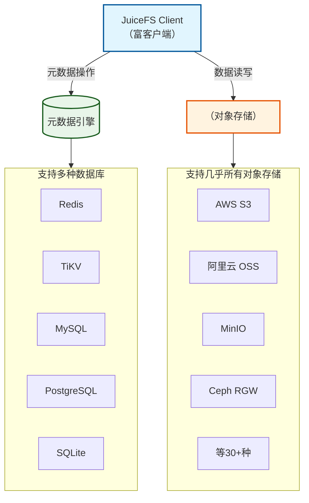
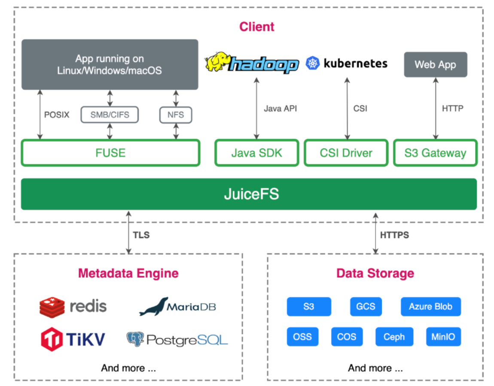
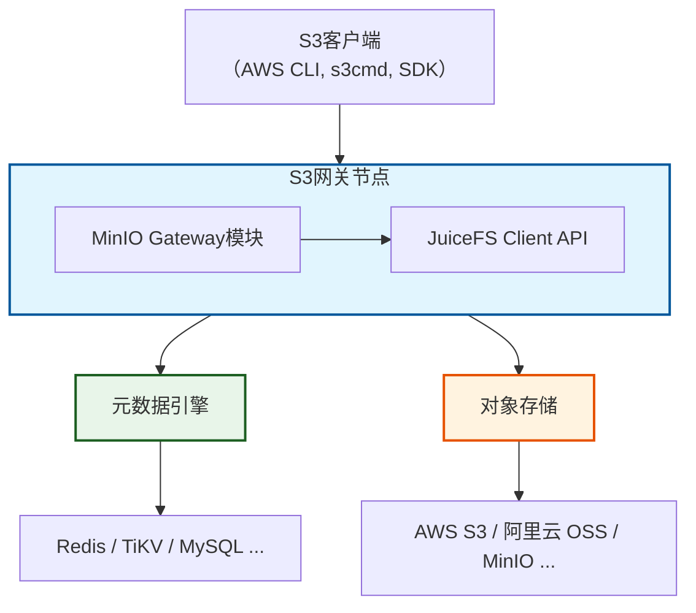
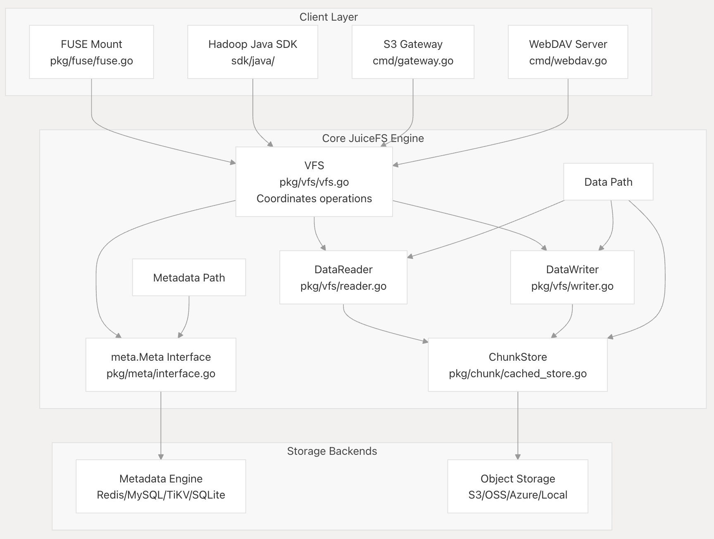
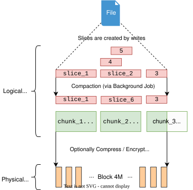

---
状态:
  - 完成
年份:
  - "2025"
imageNameKey: Juicefs调研
tags:
  - 技术学习
  - 文件系统
git tags: v1.3.1
---
# 1 整体架构  
JuiceFS的核心设计理念是“数据”与“元数据”分离[^1]。它将文件数据存储在对象存储中，并将对应的元数据（如文件名、权限、目录结构）存放在独立的数据库中。这种架构使其能够利用对象存储的海量、低成本优势，同时通过元数据引擎提供高性能的文件系统语义。  



1. **JuiceFS客户端**被设计为“富客户端”，是系统中最关键的部分。所有的文件I/O操作，甚至包括数据压缩和垃圾文件过期等后台任务，都在JuiceFS客户端中执行 。这种设计使得元数据服务能够独立运行，不存状态信息，从而提升了系统的可伸缩性和可靠性 。客户端以单个二进制文件的形式分发，简化了在Linux、macOS和Windows等不同平台上的安装和兼容性 。它提供了多种访问方式，以适应不同的应用场景，包括POSIX挂载点、Hadoop Java SDK、Kubernetes CSI驱动和S3网关。
2. **元数据引擎**负责存储所有文件系统的元数据，包括常见的文件系统元数据（如文件名、大小、权限信息、ctime和mtime、目录结构、符号链接、文件锁）以及JuiceFS特有的元数据（如文件inode、分块和分片映射、客户端会话等）。其主要作用是维护文件系统的目录树结构和各个文件的属性。元数据引擎的性能是文件系统整体性能的关键瓶颈之一。
3. **数据存储**指的是实际存储文件内容的基础对象存储。JuiceFS支持几乎所有类型的对象存储，包括公共云服务（如AWS S3）和本地对象（如Ceph和MinIO）。通过标准的对象操作接口实现与各种存储后端的无缝集成。这种设计一方面可以简化工程实现工作量和设计底座的复杂度，另一方面也能够使JuiceFS继承对象存储固有的数据可靠性、一致性和大规模可伸缩性优势。

| 组件名称  | 主要作用          | 关键职责/功能                                      | 示例/支持技术                                                                      |
| ----- | ------------- | -------------------------------------------- | ---------------------------------------------------------------------------- |
| 客户端   | 文件I/O接口和数据流协调 | 处理所有文件I/O，包括后台任务；提供多种访问协议；实现客户端侧缓存和预读        | POSIX (FUSE), Hadoop Java SDK, Kubernetes CSI Driver, S3 Gateway, Python SDK |
| 元数据引擎 | 维护文件系统结构和文件属性 | 存储文件名、大小、权限、时间戳、目录结构、文件锁、inode、分块/分片映射、客户端会话 | Redis, TiKV, MySQL, PostgreSQL, FoundationDB ; 专有高性能引擎 (企业版)                 |
| 数据存储  | 实际文件内容持久化     | 存储分块后的文件数据；提供数据可靠性和一致性                       | 公共云对象存储 (AWS S3), 自建对象存储 (Ceph, MinIO)                                       |
## 1.1 核心协议与语义  
JuiceFS 通过不同的接入方式，为上层应用提供了丰富的访问语义，确保与现有生态无缝集成。  

| 协议/语义      | 支持度  | 核心技术            | 关键特性                                              |
| ---------- | ---- | --------------- | ------------------------------------------------- |
| POSIX[^2]  | 完全兼容 | FUSE            | 提供标准的文件和目录操作，支持 flock 和 fcntl 文件锁，可作为本地磁盘使用。      |
| HDFS       | 完全兼容 | Hadoop Java SDK | 可直接替代 HDFS，与 Spark、Hive 等主流大数据引擎无缝集成。             |
| S3         | 兼容   | S3 网关           | 兼容 AWS S3 API，支持 IAM、Bucket 事件通知、多实例部署等高级特性。[^3]  |
| WebDAV     | 支持   | WebDAV 服务       | 提供基于 HTTP 协议的文件访问接口，便于在受限网络环境下使用。                 |
| Kubernetes | 原生支持 | CSI Driver      | 为容器提供共享存储。支持以 Sidecar 或 Mount Pod 方式运行，与容器生命周期一致。 |
除了基础的文件访问，JuiceFS 还提供一系列高级功能，满足数据管理和保护需求：  
1. 快照与克隆（Snapshot & Clone）：JuiceFS 支持目录级别的即时克隆（`juicefs clone`）[^4]。克隆操作**仅复制元数据，不复制数据**，因此无论数据量多大，都能在瞬间完成
2. 数据压缩： 为节省存储成本，JuiceFS 支持在客户端对数据进行压缩后再上传，有效减少对象存储的占用空间[^5]。它提供了多种压缩算法
    - **LZ4**：默认算法，在压缩速度和压缩比之间取得了良好平衡
    - **Zstandard (Zstd)**：用户可选，提供更高的压缩比，但可能会牺牲部分性能
3. 数据加密[^6]: 数据安全是核心关注点，JuiceFS 提供了传输和静态两个层面的加密

| 加密类型       | 加密范围              | 加密方式/说明                                                                     |
|------------|-------------------|-----------------------------------------------------------------------------|
| 传输加密       | 客户端 ↔ 元数据引擎       | 使用 TLS 协议建立加密连接                                                             |
| 客户端 ↔ 对象存储 | 使用 HTTPS 协议进行加密通信 |                                                                             |
| 静态加密       | 数据落盘              | 客户端加密（先加密后上传），采用混合加密体系：数据用 AES-GCM（或 ChaCha20-Poly1305）对称加密，密钥用 RSA 非对称加密保护 |
4. 强一致性与文件锁：JuiceFS 提供**强一致性**保证，一旦数据写入完成，所有客户端都能立即看到最新的内容。同时，它完整支持 **BSD locks (`flock`)** 和 **POSIX record locks (`fcntl`)**，确保在多客户端并发访问时数据的正确性。
5. 目录配额
6. 分布式缓存

### 1.1.1 对象存储语义  
JuiceFS 本质上是一个分布式文件系统，它利用对象存储作为数据持久化层。除了将底层对象存储作为“黑盒”使用外，它本身也向外（尤其是通过其 **S3 网关**）呈现了丰富的对象存储语义和特性。  
S3网关是JuiceFS 对外提供对象存储语义最核心的途径。通过 S3 网关，JuiceFS 将一个文件系统“伪装”成了一个 S3 兼容的对象存储服务
可以使用 AWS CLI、s3cmd、MinIO Client 等标准的 S3 工具直接访问 JuiceFS 文件系统中的数据[^7]。S3 网关支持的核心对象操作包括：
- **标准操作**：支持 `GetObject`, `PutObject`, `DeleteObject`, `HeadObject` 等基本的对象读写和元数据查询操作。
- **分段上传**：支持 `CreateMultipartUpload`, `UploadPart`, `CompleteMultipartUpload` 等操作，这对上传大文件尤为重要，可以提高上传效率和可靠性。
- **对象列表**：支持 `ListObjects` 及其 V2 版本，并支持使用 `prefix` 和 `delimiter` 参数来模拟目录结构，这与 S3 的扁平命名空间模型保持一致

S3 网关的核心价值在于，它作为一个协议转换层，将 JuiceFS 完整的文件系统能力通过 S3 API 开放出来，连接了传统的对象存储生态和 JuiceFS 的高性能文件系统特性，基于 MinIO Gateway 模块实现[^8]，架构图显示 S3 网关接收 S3 API 请求后，会将其映射为对元数据引擎和对象存储的操作。
  


#### 1.1.1.1 关键对象存储语义与特性  
1. **强一致性**：JuiceFS 提供**强一致性**保证，一旦数据写入完成，后续的任何读操作（无论通过何种接口）都将立即看到最新数据[^9]。这解决了原生对象存储常见的“写后读”一致性问题。
2. **对象生命周期管理**：JuiceFS 支持为文件系统设置**默认的存储类**（如标准、低频、归档），新写入的数据会自动使用该设置。你可以组合使用对象存储的**生命周期规则**和 JuiceFS 的**多级缓存**来自动管理数据的冷热分层
3. **数据保护与安全**: 
    - **客户端加密**：数据在客户端被分块后，会**先进行加密，再上传**至对象存储，保证服务端只存储密文
    - **传输加密**：客户端与对象存储之间的数据传输支持 TLS/HTTPS 等加密协议
    - **用户侧加密 (SSE-C)**：对于部分对象存储，JuiceFS 也支持**用户自行提供密钥**进行服务端加密
4. **访问控制**：可以通过配置对象存储的**最小权限策略**来限制 JuiceFS 客户端，通常读写客户端需要 `GetObject`, `PutObject`, `DeleteObject` 权限
5. **异步垃圾回收**：文件删除后，对象存储中的数据不会立即清除。JuiceFS 会通过异步的垃圾回收机制，安全地识别并清理孤立的对象数据，释放底层存储空间
6. **高性能与数据管理**:
    - **分段上传**：JuiceFS 客户端在写入大文件时，会内部将其拆分为 64MB 的 Chunk 和 4MB 的 Block，本质上启用了 S3 分段上传的所有优势，实现高吞吐和高可靠性
    - **元数据操作**：目录列表、重命名等依赖元数据的操作，在 JuiceFS 中性能远高于直接操作对象存储
    - **多版本与克隆**：**企业版**支持基于元数据的即时目录克隆与分支管理，可作为低成本的对象版本控制方案
7. **监控与可观测性**：JuiceFS 通过 Prometheus API 提供丰富的监控指标

## 1.2 源码结构说明
juiceFS社区版总代码量约7万行，很精简，且用go语言构成， 逻辑清晰简洁，远远优于较C++构成的代码栈，但是社区版缺失一些企业版的组件，会有功能限制，后文会详细说明社区版的缺失。 [^10]   
  

### 1.2.1 JuiceFS 源码大体结构  
- cmd 是代码结构总入口，所有相关功能都能在此找到入口，如 juicefs format 命令对应着 cmd/format.go
- pkg 是具体实现，核心逻辑都在其中：
    - `pkg/fuse/fuse.go` 是 FUSE 实现的入口，提供抽象 FUSE 接口
    - `pkg/vfs` 是具体的 FUSE 接口实现，元数据请求会调用 pkg/meta 中的实现，读请求会调用 pkg/vfs/reader.go,写请求会调用 pkg/vfs/writer.go
    - pkg/meta 目录中是所有元数据引擎的实现，其中：
        - `pkg/meta/interface.go` 是所有类型元数据引擎的接口定义
        - `pkg/meta/redis.go` 是 Redis 数据库的接口实现
        - `pkg/meta/sql.go` 是关系型数据库的接口定义及通用接口实现，特定数据库的实现在单独文件中（如 MySQL 的实现在 pkg/meta/sql_mysql.go）
        - `pkg/meta/tkv.go` 是 KV 类数据库的接口定义及通用接口实现，特定数据库的实现在单独文件中（如 TiKV 的实现在 pkg/meta/tkv_tikv.go）
    - `pkg/object` 是与各种对象存储对接的实现
- pkg/object 是与各种对象存储对接的实现

### 1.2.2 对象网关  
- `minio/cmd/gateway-unsupported.go`：可继承该类实现各种自定义的对象网关
- `juicefs/cmd/gateway.go`：S3对象网关入口的封装，网关的启动
- `juicefs/cmd/gateway.go`：S3对象网关入口的封装，网关的启动

在minio代码库中，与该文件类似的还有： 
- `minio/cmd/gateway-s3.go` 
- `minio/cmd/gateway-hdfs.go` 
- `minio/cmd/gateway-azure.go` 
分别实现将minio数据写入到S3、hdfs、azure类型的后端存储
### 1.2.3 文件系统 
- `juicefs/cmd/format.go`：初始化和创建文件系统 
- `juicefs/pkg/fs.go`：实现FileSystem类和接口的封装 
- `juicefs/pkg/vfs/*`：实现文件系统vfs的读写等接口 
- `juicefs/pkg/fuse/*`：实现fuse接口封装
### 1.2.4 元数据引擎 
- `juicefs/pkg/meta/base.go`：元数据引擎接口类 
- `juicefs/pkg/meta/redis.go`：redis元数据引擎接口实现 
- `juicefs/pkg/meta/sql.go`：sql类型元数据引擎接口实现 
    - `sql_pg.go、sql_mysql.go、sql_sqlite.go` 支持PostgreSQL、mysql、sqllite 
    - `juicefs/pkg/meta/tkv.go`: KV类型元数据引擎的封装和实现 
    - `tkv_tikv.go`：实现对接TiKV作为元数据引擎 
    - `tkv_fdb.go`：实现对接FoundationDB作为元数据引擎 
也支持一些其他非主流KV
### 1.2.5 数据引擎 
数据引擎将数据以chunk、block、splice进行切分，然后写入到后端存储。 
- `juicefs/pkg/object`：实现将数据写入到各种后端存储，支持数十种存储后端： 
- `juicefs/pkg/object/ceph.go`：实现将数据写入后端ceph rados 
- `juicefs/pkg/object/s3.go`: 实现将数据写入后端S3 Compatible对象存储 
- `juicefs/pkg/object/file.go`: 实现将数据写入后端文件系统中 
其他支持的后端还包括但不限于：OSS（阿里）、OBS(华为)、TOS（火山云）、QingStor、HDFS  

# 2 元数据管理 
**高层概念**：
- 文件系统（File System）：即 JuiceFS Volume，代表一个独立的命名空间。文件在同文件系统内可自由移动，不同文件系统之间则需要数据拷贝；
- 元数据引擎（Metadata Engine）：用来存储和管理文件系统元数据的组件，通常由支持事务的数据库担任。目前已支持的元数据引擎共有三大类：
    - Redis：Redis 及各种协议兼容的服务；
    - SQL：MySQL、PostgreSQL、SQLite 等；
    - TKV：TiKV、BadgerDB、etcd 等。
- 数据存储：用来存储和管理文件系统数据的组件，通常由对象存储担任，如 Amazon S3、Aliyun OSS 等；也可由能兼容对象存储语义的其他存储系统担任，如本地文件系统、Ceph RADOS、TiKV 等；
- JuiceFS 客户端（JuiceFS Client）：有多种形式，如挂载进程、S3 网关、WebDAV 服务器、Java SDK 等；
- 文件：本文中泛指所有类型的文件，包括普通文件、目录文件、链接文件、设备文件等；
- 目录：一种特殊的文件，用来组织文件树型结构，其内容是一组其他文件的索引。

**底层概念**：
- Chunk：对文件分割的逻辑单位，大小 64MiB。Chunk 的存在让 JuiceFS 在读取大文件时能快速定位，提升读取性能；
- Slice：数据写入的逻辑单位，每一次写入都会分配一个已有或新的 Slice，而在元数据中则在 Chunk 下维护着 Chunk Slice 列表。
- Block：文件分割后的实际最小存储单位，默认大小 4MiB。一个 Chunk 包含一个或多个 Slice，而一个 Slice 又包含一个或多个 Block。

  

## 2.1 元数据模型
JuiceFS 的元数据层是整个分布式文件系统的核心，负责管理文件、目录、权限、配额、锁等所有元信息。其设计目标是高性能、强一致、可扩展、可多后端适配， 但是其社区版存在一定缺失和妥协。

**元数据数据模型**：Inode、分块、分片映射。元数据引擎存储常见的文件系统元数据（文件名、大小、权限等）和JuiceFS特有的元数据，包括inode、分块和分片的关键映射信息 。对于inode键，通过将“INOD”前缀与inode ID连接来创建，inode ID以小端字节序编码（与3FS/TFS设计方法类似），以确保inode在多个FoundationDB节点上均匀分布。这种编码策略对于底层键值存储中的负载均衡有好处。  

内部数据结构层面，JuiceFS维护一个目录树结构。node记录每个文件或目录的属性，Entry描述父子节点之间的关系，Extent记录数据的位置。这些轻量级结构有助于提高内存效率  

**元数据模型**： 
- Inode（Ino）：每个文件/目录/节点都有唯一的 inode 编号（type Ino uint64） 
- Attr：每个 inode 关联一个属性结构体，包含类型、权限、所有者、时间戳、长度、nlink、ACL 等 ，从这个属性看，只是文件的基本属性，高级特性都没有包含，比如快照、远程复制、配额、worm、qos、回收站、数据分层
```go
type Attr struct {
    Flags     uint8  // flags
    Typ       uint8  // type of a node
    Mode      uint16 // permission mode
    Uid       uint32 // owner id
    Gid       uint32 // group id of owner
    Rdev      uint32 // device number
    Atime     int64  // last access time
    Mtime     int64  // last modified time
    Ctime     int64  // last change time for meta
    Atimensec uint32 // nanosecond part of atime
    Mtimensec uint32 // nanosecond part of mtime
    Ctimensec uint32 // nanosecond part of ctime
    Nlink     uint32 // number of links (sub-directories or hardlinks)
    Length    uint64 // length of regular file

    Parent    Ino  // inode of parent; 0 means tracked by parentKey (for hardlinks)
    Full      bool // the attributes are completed or not
    KeepCache bool // whether to keep the cached page or not

    AccessACL  uint32 // access ACL id (identical ACL rules share the same access ACL ID.)
    DefaultACL uint32 // default ACL id (default ACL and the access ACL share the same cache and store)

    Tier uint8 // storage tier of the file
}
```
- Entry：目录项（dentry），描述父目录下的某个名字和 inode 的映射关系 
```bash
type Entry struct {
    Inode Ino
    Name  []byte
    Attr  *Attr
}
```
- Slice/Chunk：文件数据的分块描述
```go
type Slice struct {
    Id   uint64
    Size uint32
    Off  uint32
    Len  uint32
}
```

 **主要对象**： 
- 文件/目录的属性（inode -> attr） 
- 目录项（parent inode + name -> inode/type） 
- 块信息（inode + chunk index -> slice list） 
- 符号链接、xattr、锁、配额、会话等

**元数据Key/Value 的定义**：  JuiceFS 支持多种元数据后端（如 Redis、MySQL、TiKV、SQLite、KV），但核心思想都是将元数据抽象为一组 key-value 对，不同后端实现细节略有差异。  
- **设计原则**：
    - key 唯一标识一个元数据对象 
    - key 结构紧凑，便于高效查找和范围扫描 
    - key兼容多后端（字符串/二进制/表结构） 
    - value 尽量紧凑，减少存储和网络开销 
    - value结构化，便于反序列化和升级 
    - value支持扩展（如增加 ACL、配额等字段）

### 2.1.1 juicefs和tfs元数据模型比较  
#### 2.1.1.1 tfs元数据模型  
每一个tfs文件系统中，每个rank创建一个rbd设备，设备名字是tfs-meta rankid{0..6}，在该设备上启动一个rocksdb实例，用来存储base文件系统中需要存储的kv
##### 2.1.1.1.1 Base 文件系统
inode和dentry分离，通过分布式事务保证每次op操作的分布式一致性，单个节点的原子性由Rocksdb的事务保证 , 多条KV写数据库动作放到一个事务中提交数据库，保证inode和dentry等变化的原子性。
1. inode kv - `Tfs_MDCache::construct_inode_key(...)`
    - base inode: B/primary_pino/I/ino  ->  InodeInfoToDB
2. dentry kv
    - base dentry: B/pino/D/16位hash/name -> DentryInfoToDB
3. 扩展属性： `Tfs_MDCache::construct_xattr_key(...)`
    - B/primary_pino/X/ino/xattr_name ->  xattr_value
4. 软连接：`Tfs_MDCache::construct_symlink_key(...)`
    - base： B/primary_pino/SYM/ino ->  symlink path
5. 回收站kv： `Tfs_MDCache::construct_recyclebin_info_key(...)`
    -  RD/ino  ->  RecyclebinInfo
    
```columns
id: e67BDw7e8GYAG_TeLb0y4
===
**BaseInode(内存结构)**
```c++
struct Tfs_inodeno_t {
    _Tfs_inodeno_t val;
    _Tfs_snapid_t snapid;
    _Tfs_cloneid_t cloneid;
} 
typedef struct Tfs_inode_t {
    Tfs_inodeno_t ino = 0;
    Tfs_inodeno_t pino = 0;
    // 作用：为了将同一个目录的inode集中到一起，没有使用pino是因为rename时pino会改变，如果使用pino集中inode，那么rename时需要删除原来的kv再设置新的kv，还有一个问题就是lookup ino这些接口感知不到pino的变化
    Tfs_inodeno_t primary_pino = 0;
    Tfs_inodeno_t ppino = 0; 
    uint32_t   rdev = 0; 

    utime_t    ctime;
    utime_t    btime;

    uint32_t   mode = 0;
    uid_t      uid = 0;
    gid_t      gid = 0;

    std::atomic<int32_t>    nlink{0};

    tfs_file_layout_t layout;
    tfs_file_layout_t hot_layout;
    uint32_t tier_flag = 0;

    std::array<uint64_t, TFS_TIER_BITMAP_SIZE> tier_bitmap = {0};
    uint64_t tier_policy_id = 0;
    uint64_t   size = 0;    
    uint64_t   max_size_ever = 0; 
    uint32_t   truncate_seq = 0;
    uint64_t   truncate_size = 0, truncate_from = 0;
    uint32_t   truncate_pending = 0;
    utime_t    mtime;   // file data modify time.
    utime_t    atime;   // file data access time.
    //ino pino  gives the snap which we access
    //version just db store , ino pino is given by user, not stored in db or db just
    uint64_t max_snap_id = 0;           //given by user not stored in db
    FS_VERSION type_version{{0,0,0}};

    // used for quota. files total size under dir [dir only]
    std::atomic<uint64_t>   dir_size{0};
    std::atomic<uint64_t>   dir_inodes{0};

    //对map的操作一定要在锁的保护下进行
    std::unordered_map<tfs_user_quota_key, uint64_t, User_Quota_KeyHash, User_Quota_KeyEqual> user_dir_statis;  //用户/用户组配额子目录的容量/文件数统计
    
    // used for quota. once created hard link
    bool once_hardlink = 0;

    std::atomic<uint64_t>   nfiles{0};
    std::atomic<uint64_t>   nsubdirs{0};
    std::atomic<uint64_t>   nhlinks{0};

    // special stuff
    version_t version = 0;           // auth only, for log event replay
    uint32_t  xattrs_size = 0;

    // scrub
    mono_time last_scrub_stamp = mono_clock::zero();
    version_t last_scrub_version = 0;

    int32_t   rankid = -1;
    bool      enable_snapdiff = false;
    bool temporarily_unavailable = false;

    // worm
    uint64_t worm_id = 0;
    uint32_t worm_status = 0;

    bool quota_node = false;

    epoch_t epoch = TFS_DB_EPOCH_MAX - 1;
    std::set<uint64_t> cow_set;
    uint64_t nfs_verifier = 0;
} BaseInode;

===
**InodeInfoToDB(磁盘结构）**
```proto
message InodeInfoToDB {
    required int32 epoch = 1;
    optional uint64 ino = 2;
    optional uint64 snapid = 3;
    optional uint64 cloneid = 4;
    optional uint64 pino = 5;
    optional uint64 pino_snapid = 6;
    optional uint64 pino_cloneid = 7;
    optional uint64 primary_pino = 8;
    optional uint64 primary_pino_snapid = 9;
    optional uint64 primary_pino_cloneid = 10;
    optional uint64 ppino = 11;
    optional uint64 ppino_snapid = 12;
    optional uint64 ppino_cloneid = 13;
    optional uint32 rdev = 14;
    optional uint64 atime = 15;
    optional uint64 mtime = 16;
    optional uint64 ctime = 17;
    optional uint64 btime = 18;
    optional uint32 mode = 19;
    optional uint32 uid = 20;
    optional uint32 gid = 21;
    optional uint32 nlink = 22;
    optional uint64 stripe_unit = 23;
    optional uint64 stripe_count = 24;
    optional uint64 object_size = 25;
    optional uint64 pool_id = 26;
    optional uint64 size = 27;
    optional uint64 max_size_ever = 28;
    optional uint32 truncate_seq = 29;
    optional uint64 truncate_size = 30;
    optional uint64 truncate_from = 31;
    optional uint32 truncate_pending = 32;
    optional uint64 max_snap_id = 33;
    optional uint64 birth_id = 34;
    optional uint64 last_snap_id = 35;
    optional uint64 last_copy_snap_id = 36;
    optional uint64 start_id = 37;
    optional uint64 end_id = 38;
    optional uint64 dir_size = 39;
    optional uint64 dir_inodes = 40;
    optional bool once_hardlink = 41;
    optional uint64 nfiles = 42;
    optional uint64 nsubdirs = 43;
    optional uint64 nhlinks = 44;
    optional uint64 version = 45;
    optional uint32 xattr_size = 46;
    optional int32 rankid = 47;
    repeated QuotaPair user_dir_statis = 48;
    optional uint32 worm_status = 49;
    optional uint64 worm_id = 50;
    optional bool enable_snapdiff = 51;
    optional uint64 tier_stripe_unit = 52;
    optional uint64 tier_stripe_count = 53;
    optional uint64 tier_object_size = 54;
    optional uint64 tier_pool_id = 55;
    optional uint32 tier_flag = 56;
    repeated uint64 tier_bitmap = 57;
    optional uint64 tier_policy_id =58;
    optional bool quota_node = 59;
    repeated uint64 cow_set = 60;
    optional uint64 nfs_verifier = 61;
}
```

----  

```columns
id: 5Puh2lK67iuoBwOglxZIT
===
**BaseDentry(内存结构)**
```c++
typedef struct base_dentry {
Tfs_inodeno_t ino;
    Tfs_inodeno_t pino;
    Tfs_inodeno_t primary_pino;
    mode_t mode = 0;
    uint32_t type;
    version_t version;
    DentryVersionInfo versrion = {0};
    unsigned char exist_flag;
    epoch_t epoch = TFS_DB_EPOCH_MAX - 1;
    mempool::mds_dentry_co::string real_name;
    bool creating = false;
    string nfs_sillyrename_oldname; // save original name after silly renmae on nfs
    std::set<uint64_t> cow_set;
} BaseDentry;

===

**DentryInfoToDB(磁盘结构）**  
```c++
message DentryInfoToDB {
    required int32 epoch = 1;   //每个发布版本一个epoch号
    optional uint64 ino = 2;
    optional uint64 snapid = 3;  //
    optional uint64 cloneid = 4;
    optional uint64 pino = 5;
    optional uint64 pino_snapid = 6;
    optional uint64 pino_cloneid = 7;
    optional uint64 primary_pino = 8;
    optional uint64 primary_pino_snapid = 9;
    optional uint64 primary_pino_cloneid = 10;
    optional uint64 type = 11;
    optional uint64 version = 12;
    optional uint64 birth_id = 13;
    optional uint64 last_snap_id = 14;
    optional uint64 start_id = 15;
    optional uint64 end_id = 16;
    optional uint32 mode = 17;
    optional string real_name = 18;
    repeated uint64 cow_set = 19;
    optional string nfs_sillyrename_oldname = 20;
} 
```
 

##### 2.1.1.1.2 快照  
```columns
id: 5Puh2lK67iuoBwOglxZIT
===
**FS_Snap_Info(内存结构)**
```c++
typedef struct fs_snap_info {
    uint64_t primary_pino = 0;
    uint64_t inode_id = 0;
    uint64_t snap_id = 0;
    uint64_t snap_seq = 0;    //used for resend the message of removesnap to monitor
    uint64_t cap = 0;
    uint64_t ctime = 0;
    uint32_t state = 0;
    char snap_name[NAME_MAX] = { 0 };
    char path[PATH_MAX] = { 0 };
    uint32_t epoch = TFS_DB_EPOCH_MAX - 1;

    bool enable_snapdiff = false;
    bool temporarily_unavailable = false;
} FS_Snap_Info;

===

**SnapInfoToDB(磁盘结构）**  
```c++
message SnapInfoToDB {
    required int32 epoch = 1;
    optional uint64 primary_pino = 2;
    optional uint64 inode_id = 3;
    optional uint64 snap_id = 4;
    optional uint64 cap = 5;
    optional uint64 ctime = 6;
    optional uint32 state = 7;
    optional string name = 8;
    optional string path = 9;
    optional bool enable_snapdiff = 10;
    optional bool temporarily_unavailable = 11;
}
```

```columns
id: 5Puh2lK67iuoBwOglxZIT
===
**fs_snap_base(内存结构)**
```c++
struct fs_snap_base_t {
    ino_t last_snap_ino;
    uint64_t snap_epoch;
}fs_snap_base;

===

**SnapBaseInfo(磁盘结构）**  
```c++
message SnapBaseInfo {
    required int32 epoch = 1;
    optional uint64 snap_epoch = 2;
    optional uint64 last_used_snap_id = 3;
}
```


- FS_Snap_Info：在snapserver上保存目录快照配置信息， 每一个快照的描述信息
    - RB_ENABLE_SNAPDIFF/primary_pino/ino -> SnapInfoToDB : `Tfs_MDCache::construct_enable_snapdiff_key(...)`
    - SNAP/snap.inode_id/snap.snap_id  -> SnapInfoToDB :  `Tfs_MDCache::construct_snap_info_key(...)`
- FS_Snap_Base：保存snapid的版本信息 , `Tfs_MDCache::transactional_create_snap(...)`
    - SBASE -> SnapBaseInfo
- snap inode： `Tfs_MDCache::update_snap_inode_and_xattr(...)`
    - S/ino.snapid/primary_pino/I/ino  -> ""  :  `Tfs_MDCache::construct_inode_key(...)`
    - S/primary_pino/I/ino/ino.snapid ->  InodeInfoToDB(cow后的inode): `Tfs_MDCache::construct_inode_snap_key(...)`
    - S/primary_pino/X/ino/ino.snapid ->  xattr_value
    - S/primary_pino/SYM/ino/ino.snapid  -> symlink path
- snap dentry: `Tfs_MDCache::create_snap_dentry(...)`
    - S_D/pino.snapid/pino/D/16位hash/name -> "" :  `Tfs_MDCache::construct_snapid_dentry_key(...)`
    - S/pino/D/16位hash/name/pino.snapid -> DentryInfoToDB(某个快照的dentry) ：  `Tfs_MDCache::construct_dentry_snapid_key(...)`
- R-key ： 创建文件/目录时生成R-key，避免回滚全遍历inode和dentry kv,
    - inode： R_I/birth_id/B/primary_pino/I/ino -> InodeInfoToDB , `Tfs_MDCache::construct_replicate_inode_key(...)`
    - dentry： R_D/birth_id/B/pino/D/16位hash/name -> DentryInfoToDB ，  `Tfs_MDCache::construct_replicate_dentry_key(...)`

##### 2.1.1.1.3 快照回滚  
 rollback在保存元数据差异时，都是首先创建一个rbd设备，在rbd上依赖bluefs env启动一个rocksdb实例，将元数据差异按照kv的形式存储在rocksdb实例中，在rollback apply阶段遍历rocksdb实例完成apply操作。  

#### 2.1.1.2 tfs和juicefs元数据项对比   
## 2.2 元数据操作  
### 2.2.1 基于路径查询文件  
元数据引擎中只记录了每个目录的直接子节点。当应用提供一个路径来访问文件时，JuiceFS 需要逐级查找。现在假设应用想打开文件 `/dir1/dir2/testfile`，则需要：

1. 在根目录（Inode 号固定为 1）的 Edge 结构中搜寻 name 为 "dir1" 的 entry，得到其 inode 号 N1
2. 在 N1 的 Edge 结构中搜寻 name 为 "dir2" 的 entry，得到其 inode 号 N2
3. 在 N2 的 Edge 结构中搜寻 name 为 "testfile" 的 entry，得到其 inode 号 N3
4. 根据 N3 搜寻其对应的 `Node` 结构，得到该文件的相关属性
在以上步骤中，任何一步搜寻失败都会导致该路径指向的文件未找到。

# 3 数据管理  
## 3.1 数据模型
### 3.1.1 文件数据拆分  
根据文件属性中的 inode 和 size 字段，即可找到跟文件内容相关的元数据。现在假设有个文件的 inode 为 100，size 为 160 MiB，那么该文件一共有 `(size-1) / 64 MiB + 1 = 3` 个 Chunks，如下：  

```
File:  |_ _ _ _ _ _ _ _ _ _ _ _ _ _ _ _|_ _ _ _ _ _ _ _ _ _ _ _ _ _ _ _|_ _ _ _ _ _ _ _|
Chunk: |<---        Chunk 0        --->|<---        Chunk 1        --->|<-- Chunk 2 -->|
```
 Slices 主要在数据写入时生成，可能互相之间有覆盖，也可能未完全填充满 Chunk。因此，在使用前需要顺序遍历这个 Slices 列表，并重新构建出最新版的数据分布，做到：
1. 有多个 Slice 覆盖的部分以最后加入的 Slice 为准
2. 没有被 Slice 覆盖的部分自动补零，用 sliceId = 0 来表示
3. 根据文件 size 截断 Chunk

现假设 Chunk 0 中有 3 个 Slices，分别为：  
```go
Slice{pos: 10M, id: 10, size: 30M, off: 0, len: 30M}
Slice{pos: 20M, id: 11, size: 16M, off: 0, len: 16M}
Slice{pos: 16M, id: 12, size: 10M, off: 0, len: 10M}
```

```
图示如下（每个 '_' 表示 2 MiB）：
   Chunk: |_ _ _ _ _ _ _ _ _ _ _ _ _ _ _ _ _ _ _ _ _ _ _ _ _ _ _ _ _ _ _ _|
Slice 10:           |_ _ _ _ _ _ _ _ _ _ _ _ _ _ _|
Slice 11:                     |_ _ _ _ _ _ _ _|
Slice 12:                 |_ _ _ _ _|

New List: |_ _ _ _ _|_ _ _|_ _ _ _ _|_ _ _ _ _|_ _|_ _ _ _ _ _ _ _ _ _ _ _|
               0      10      12         11    10             0
```

重构后的新列表包含且仅包含了此 Chunk 的最新数据分布，具体如下：
```go
Slice{pos:   0, id:  0, size: 10M, off:   0, len: 10M}
Slice{pos: 10M, id: 10, size: 30M, off:   0, len:  6M}
Slice{pos: 16M, id: 12, size: 10M, off:   0, len: 10M}
Slice{pos: 26M, id: 11, size: 16M, off:  6M, len: 10M}
Slice{pos: 36M, id: 10, size: 30M, off: 26M, len:  4M}
Slice{pos: 40M, id:  0, size: 24M, off:   0, len: 24M} // 实际这一段也会省去
```

ROW机制用于数据修改。当文件被修改时，JuiceFS会创建一个新的分片，并在其上传后更新元数据以指向新的分片。原始被覆盖的分片内容随后通过异步的垃圾回收过程从对象存储中删除 。这种分片一次写入的方法降低了对底层对象存储一致性的依赖，并简化了缓存系统，使数据一致性更易于保证。  

### 3.1.2 数据对象  
#### 3.1.2.1 对象命名  
Block 是 JuiceFS 管理数据的基本单元，其大小默认为 4 MiB，且可在文件系统格式化时配置，允许调整的区间范围为 [64 KiB, 16 MiB]。每个 Block 上传后即为对象存储中的一个对象，其命名格式为 `${fsname}/chunks/${hash}/${basename}`，其中：
- fsname 是文件系统名称
- “chunks”为固定字符串，代表 JuiceFS 的数据对象
- hash 是根据 basename 算出来的哈希值，起到一定的隔离管理的作用
- basename 是对象的有效名称，格式为 `${sliceId}_${index}_${size}`，其中：
    - sliceId 为该对象所属 Slice 的 ID，JuiceFS 中每个 Slice 都有一个全局唯一的 ID
    - index 是该对象在所属 Slice 中的序号，默认一个 Slice 最多能拆成 16 个 Blocks，因此其取值范围为 [0, 16)
    - size 是该 Block 的大小，默认情况下其取值范围为 (0, 4 MiB]

目前使用的 hash 算法有两种，以 basename 中的 sliceId 为参数，根据文件系统格式化时的 [HashPrefix] 配置选择：  
```go
func hash(sliceId int) string {
    if HashPrefix {
        return fmt.Sprintf("%02X/%d", sliceId%256, sliceId/1000/1000)
    }
    return fmt.Sprintf("%d/%d", sliceId/1000/1000, sliceId/1000)
}
```
假设一个名为 `jfstest` 的文件系统中写入了一段连续的 10 MiB 数据，内部赋予的 SliceID 为 1，且未开启 HashPrefix，那么在对象存储中则会产生以下三个对象  
```
jfstest/chunks/0/0/1_0_4194304
jfstest/chunks/0/0/1_1_4194304
jfstest/chunks/0/0/1_2_2097152
```

类似地，现在以上一节的 64 MiB 的 Chunk 为例，它的实际数据分布如下：  
```
 0 ~ 10M: 补零
10 ~ 16M: 10_0_4194304, 10_1_4194304(0 ~ 2M)
16 ~ 26M: 12_0_4194304, 12_1_4194304, 12_2_2097152
26 ~ 36M: 11_1_4194304(2 ~ 4M), 11_2_4194304, 11_3_4194304
36 ~ 40M: 10_6_4194304(2 ~ 4M), 10_7_2097152
40 ~ 64M: 补零
```
据此，客户端可以快速找到应用所需数据。例如，在 offset 为 10MiB 位置读取 8MiB 数据，会涉及 3 个对象，具体为：
- 从 `10_0_4194304` 读取整个对象，对应读取数据的 0 ～ 4 MiB
- 从 `10_1_4194304` 读取 0 ～ 2 MiB，对应读取数据的 4 ～ 6 MiB
- 从 `12_0_4194304` 读取 0 ～ 2 MiB，对应读取数据的 6 ～ 8 MiB

# 4 S3 gateway  
JuiceFS S3 网关功能是通过 [MinIO S3 网关](https://github.com/minio/minio/tree/ea1803417f80a743fc6c7bb261d864c38628cf8d/docs/gateway)实现的，利用 MinIO 的 [`object 接口`](https://github.com/minio/minio/blob/d46386246fb6db5f823df54d932b6f7274d46059/cmd/object-api-interface.go#L88) 将 JuiceFS 文件系统作为 MinIO 服务器的后端存储，提供接近原生 MinIO 的使用体验，同时继承 MinIO 的许多高级功能。在这种架构中，JuiceFS 就相当于 MinIO 实例的一块本地磁盘[^11]

# 5 对象+文件互通  
无论用**文件协议（POSIX/NFS/SMB）** 还是**对象协议（S3 / 兼容 S3 网关）** 访问，背后依赖的都是**同一套元数据（inode/dentry/chunk/slice 映射）**  

元数据的核心作用：唯一映射 “文件 / 对象 → 底层数据，JuiceFS 的元数据（存在 Redis/TiKV/MySQL 中）只记录一件事：  
```txt
「路径/对象名」 → inode → Chunk/Slice → 对象存储Key
```

- 当用**文件方式**访问（如 `cat /jfs/file.txt`）：客户端先通过路径找到 Dentry → 映射到 inode → 从元数据读取 inode 关联的 Chunk/Slice → 读取对象存储数据；
- 当用**对象方式**访问（如 `s3cmd get s3://jfs/file.txt`）：客户端先把 S3 的 “bucket/key” 转换为 JuiceFS 的路径 → 后续流程和文件访问**完全一致**（找 Dentry→inode→Chunk/Slice）。

JuiceFS 的 S3 网关（`cmd/gateway/s3.go`）本质是 “协议转换器”，所有对象操作最终都会转为元数据的文件操作 ，即在文件系统之上又套了一层对象的壳 。  

一致性保证：  
- **唯一真相源**：所有 POSIX、S3 操作都依赖同一套 `inode/dentry` 元数据引擎，无双份元数据；
- **网关无独立元数据**：S3 网关只做 **Key ↔ 文件路径** 字符串转换，不落地自己的对象元数据；
- **属性强制映射**：S3 的 `LastModified` / `Content-Length` / 自定义 Meta 全部实时从 inode 读取；
- **底层对象无元数据**：对象存储只存 Slice 裸数据，不维护目录、文件名、属性，从根源杜绝分裂；
- **事务 + 版本控制**：元数据修改带版本号，多挂载点、多网关并发通过 CAS 保证强一致。

# 6 参考
1. [tfs元数据kv结构（持久化及内存）梳理](http://10.128.106.117/pages/viewpage.action?pageId=77422159)
2. [JuiceFS的架构设计特点分析-V3.docx](https://lenovonetapp-my.sharepoint.cn/:w:/g/personal/peng_chen_lenovonetapp_com/IQDeDnJ026kdQbkbRd5Ka4CYAXHz3wFf4J2wEdTZ4ATWItY?e=IoqkAX)

[^1]: https://www.juicefs.io/docs/community/introduction/
[^2]: https://www.juicefs.io/docs/community/introduction/
[^3]: https://s.juicefs.com/docs/zh/community/guide/gateway/#deploy-in-kubernetes
[^4]: https://www.juicefs.io/docs/zh/community/guide/clone/
[^5]: https://cloud.tencent.cn/developer/article/2282483?from=15425
[^6]: https://www.juicefs.io/docs/zh/community/security/encryption/
[^7]: https://www.juicefs.io/docs/zh/community/architecture/
[^8]: https://www.juicefs.io/zh-cn/blog/usage-tips/juicefs-s3-gateway
[^9]: https://s.juicefs.com/docs/zh/community/introduction/#__docusaurus_skipToContent_fallback
[^10]: https://deepwiki.com/juicedata/juicefs/2.1-system-overview-and-data-flow#system-overview-and-data-flow
[^11]: https://juicefs.com/docs/zh/community/guide/gateway/
[^12]: https://deepwiki.com/juicedata/juicefs/2-core-architecture
