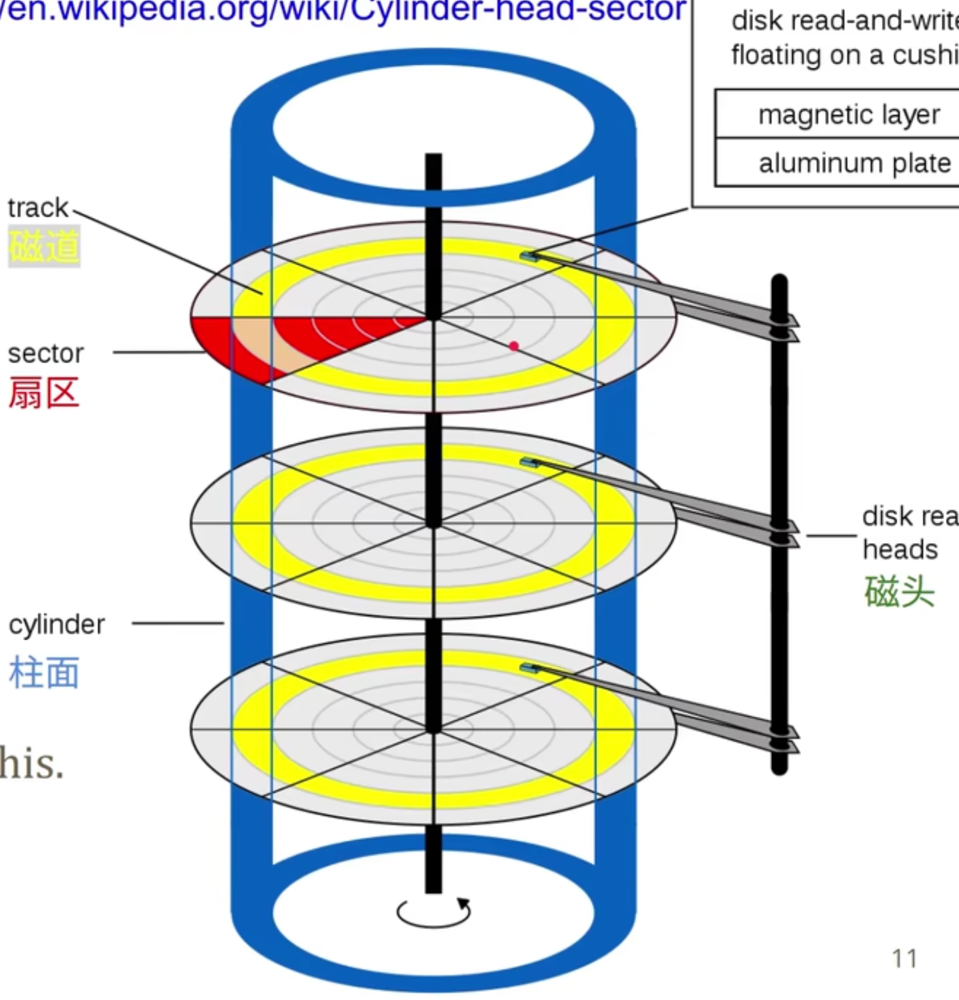
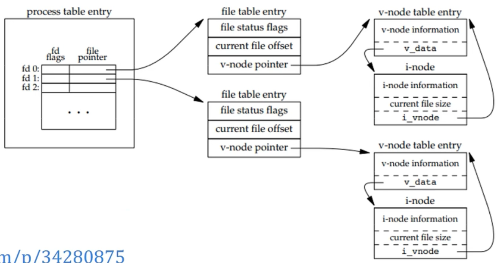
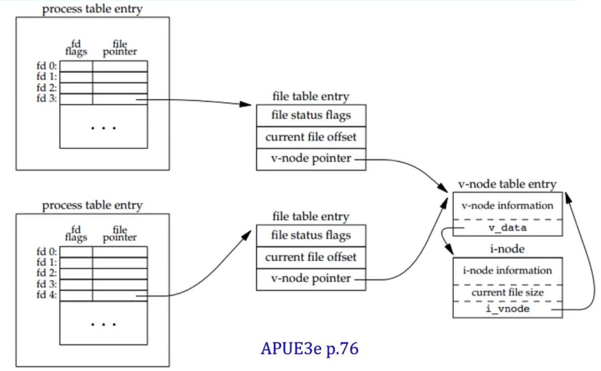
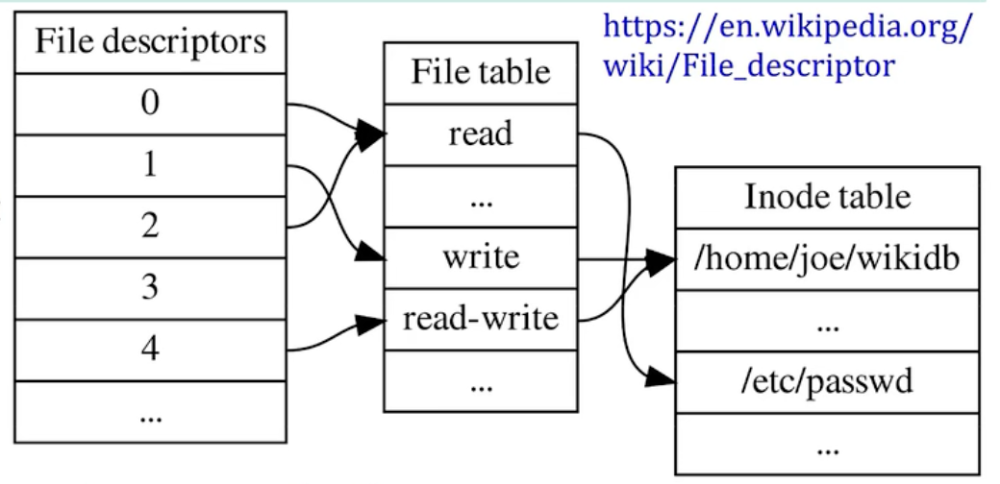
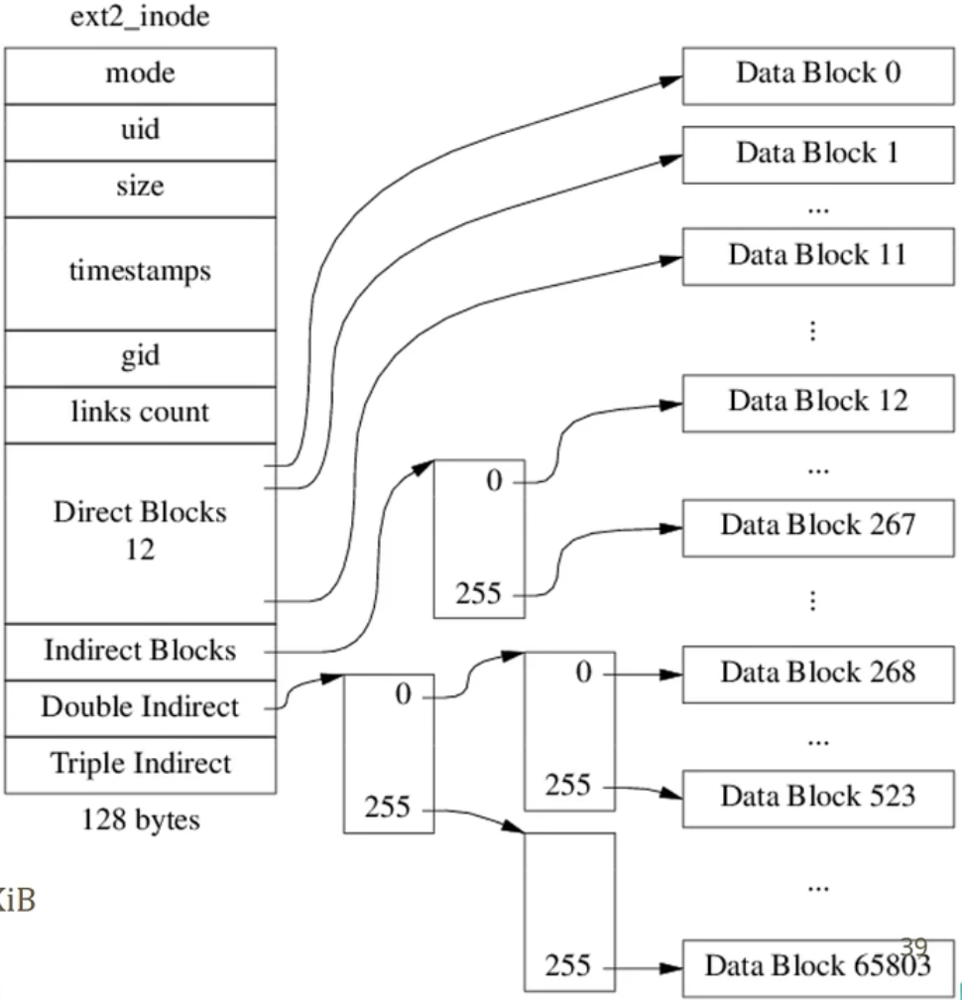

【Linux 文件系统（一）：抽象】https://www.bilibili.com/video/BV1jM411W7jV?vd_source=69529570b7e3c767ddc3673505bd382c
# 1 抽象
## 1.1 文件抽象
文件  = 字节： File = a sequence of bytes

10个基本syscalls
- open/close/(creat)：打开/关闭/(创建)
- read/write/lseek/(tell): 读/写/重定位/(返回当前位置)
- fstat/ftuncate：返回元数据/文件截断
- unlink/mkdir/dup...：删除/创建目录/复制文件操作符
## 1.2 文件系统抽象
- 基本而言 - Map<string, string> //from filename to content
- 或者具象一点：
```c
struct File{
	mode(permissions, type), size, user, group,
	timestamps(atime, mtime, ctime), //(访问时间，内容修改时间，元数据修改时间)
	content(bytes)
};
Map<string, File>  //from filepath to File
```
- 更加具象一点：
```c
typedef uint32_t inode_num_t;  //文件系统唯一
Map<string, inode_num_t> dirs; //map from file_path to inode number
Map<inode_num_t, string> files; //map from inode number to content
或者
Map<inode_num_t, File>  files;  //each inode is a file
```
## 1.3 磁盘抽象：块设备
```c++
//物理抽象
/*
扇区size：
- 2010年以前： 512B
- 以后：4kB
磁盘坐标：
- CHS：柱面/磁头/扇区
- LBA
*/
class Disk //read-write in sectors
{
	//Logical block addressing (LBA) - 逻辑块地址
	readSector(long n, void* buf);
	writeSector(long n, const void* buf);
}

//逻辑抽象
/*
典型的块是1KB
*/
class BlockDevice
{
	//Linear space of contiguous blocks - 连续块的线性空间
	readSector(long n, void* buf);
	writeSector(long n, const void* buf);
}


```

**文件系统将一个块设备转换为文件API**

```c++
class BlockDevice
{
	//Linear space of contiguous blocks - 连续块的线性空间
	readSector(long n, void* buf);
	writeSector(long n, const void* buf);
}

class FileSystem
{
	explicit FileSystem(BlockDevice *dev);
	File *open(string filename, int mode);
	read(File *, void *buf, int len);
	write(File*, const void* buf, int len);
	lseek(File*, offset, whence);
	...
}
```

# 2 磁盘
柱面-磁头-扇区的方式定位磁盘地址，即CHS方式，如下图



现在的磁盘会通过磁盘控制器暴露出来一个**线性地址（LBA）**，会自动将该线性地址换算为CHS地址
# 3 分块读写
## 3.1 Blocks and block groups
### 3.1.1 块
Notice：和磁盘分区没有关系

文件系统和文件都是以block为单位分配空间的，而不是字节

disk sector size <= block size <= memory page size

### 3.1.2 块组描述符
Ext2 group descriptor: 32B
Ext4 is 64B

### 3.1.3 Framents and Clusters
Ext2 and FFS对小于一个block的文件支持fragment， 一个fragment是一个block的1/2或者1/4，最小是1KB
Ext4看起来要用clusters替换fragments

简单而言，block_size = fragment size = cluster size

块组提升了HDD的吞吐量，但是对SSD不太好用

# 4 内核文件表
## 4.1 inode内容
1. 必选：
- mode（type+权限)
- size（单位：字节)
- nlink
- block地址
2. 不包括
- 文件名
3. 可选
- 时间戳(atime, ctime, mtime)
- uid, gid
- 主次设备number

inode num在一个文件系统中唯一，硬链接不可跨文件系统，软连接可以

## 4.2 一个进程打开两个文件


## 4.3 两个进程打开同一个文件

## Unix文件描述符

三个level：
1. 文件描述符表（同一个进程只有一个文件描述符表，不同线程共享）
2. 文件表
3. inode表

文件描述符表每个进程独享一个，文件表和inode表是全局的；文件当前偏移量在文件table，文件当前size在inode表

- open两次：在file表中有两项，每个fd拥有自己的offset，互补干扰
- open然后dup，copy文件描述符，一个文件表项，两个fd指向同一个file object
- open然后fork，两个fd指向同一个file对象，共享offset

# inode
## Ext2


sizeof(struct ext2_inode) == 128 ==>磁盘结构
8 inodes per 1KB block
32-bit inode number, 256 per 1BK indirect block

1KB block时，最大的文件为： 12 + 256 + 256^2 + 256^3 = 16843020 KB 

Ext2对小文件友好，不适合图像或者视频（间接inode开销比较大）

128M文件的话，比如1K block：
- 12个direct block  --> 12KB
- 256间接block --> 268KB
- 256 + 二级间接block  --> 12 + 256 + 256^2 = 65804KB
- 255 + 三级间接block --> 剩余的65268
- 一共 131072个data block, 共515个间接block
