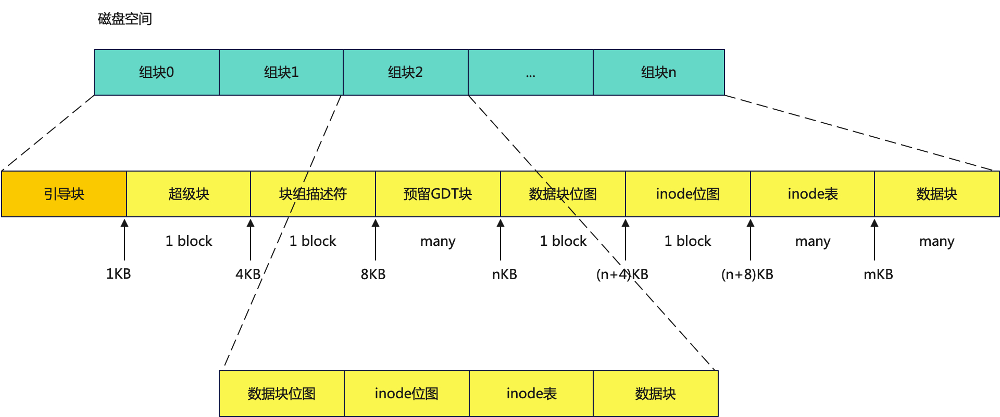
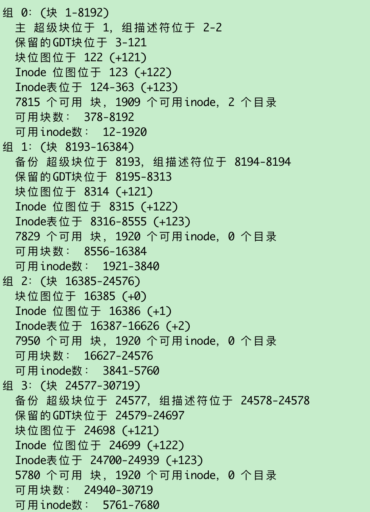
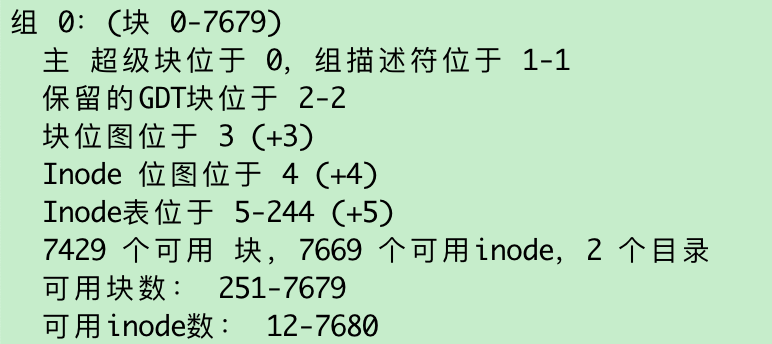
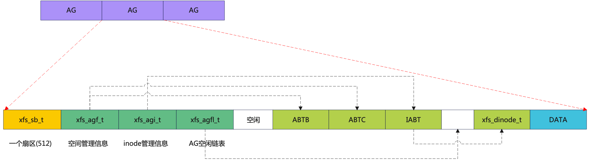
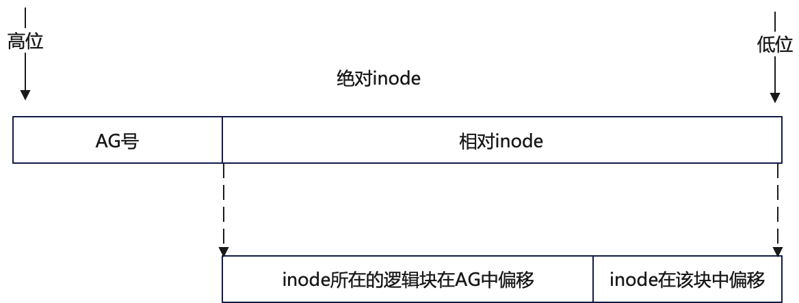
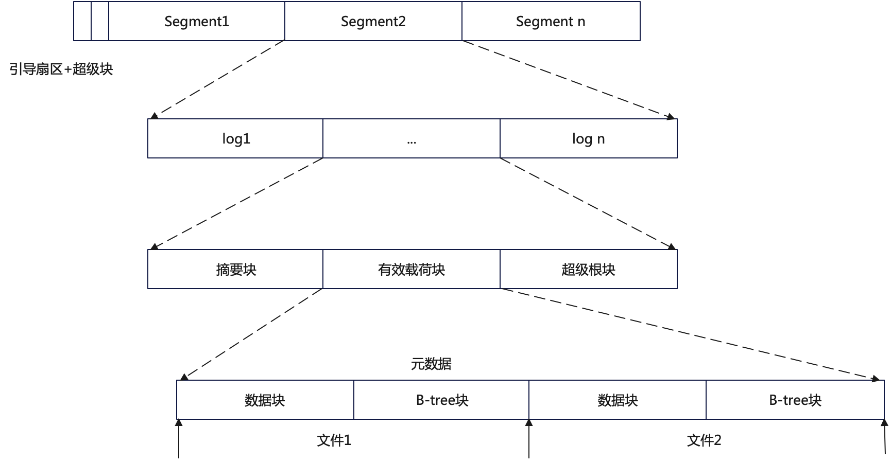

# 磁盘空间布局

文件系统的核心功能就是实现对磁盘空间的管理，要知道哪些空间可以用，哪些空间不可以用。

## 基于固定功能区

典型文件系统： Linux ExtX

ExtX将磁盘划分为等份的若干区域，这个区域被称为块组，磁盘空间的管理以块组为单位，以下是磁盘分区的布局图（以4K逻辑块大小为例），其中块组0最复杂，其他的相似。


概念说明：

- 超级块：存储文件系统级别的信息，比如逻辑块大小、挂载点等
- 块组描述符表：ext文件系统每一个块组信息使用32字节描述，这32个字节称为块组描述符，所有块组的块组描述符组成块组描述符表GDT(group descriptor table)。假如block大小为4KB的文件系统划分了143个块组，每个块组描述符32字节，那么GDT就需要143*32=4576字节即两个block来存放。
- 预留GDT块：保留GDT用于以后扩容文件系统使用，防止扩容后块组太多，使得块组描述符超出当前存储GDT的blocks。
- inode：索引节点，即索引数据的节点，一个inode对应一个文件，通常每个块组有若干的inode，称为inode表。
  - 由于inode数量固定，且存储形式固定，可以根据偏移给与编号，即ino_id。

- 位图，包括数据块位图和inode位图，用来描述对应资源的使用，0表示未使用，1表示已经使用。

我们使用如下命令可以创建并格式化一个文件系统：

```shell
dd if=/dev/zero of=30m.file bs=1M count=30
mkfs.ext2 30m.file -b 1K
```

然后使用`dump2fs`查看



如果块大小为4K，那么有如下块组：

原因：ExtX使用逻辑块存储数据位图，当block = 1K时，对应的数据块位图可以管理1024 * 8个数据块，即**1024**[一个block的size] * **(1024 * 8)** [block的数量]= 8M的空间，30M就需要4个块组；当block = 4K时，对应的数据块位图可以管理4 * 1024 * 8个数据块，即(4 * 1024) * (4 * 1028 *8) = 128M， 因此一个块组就可以。

## 基于非固定功能区

基于固定功能区的 磁盘空间管理布局空间智能清晰，便于手动进行丢失数据恢复，但是也容易出现资源不足的情况，比如海量小文件场景。

非固定功能区的磁盘空间管理也分为数据和元数据，但是元数据和数据的区域非固定，随着文件系统对资源的需求而动态分配，典型有XFS和NTFS。

XFS文件系统将磁盘划分为等份的区域，称为分配组（AG），XFS对每个分配组进行独立管理，AG的容量可以很大，最大可以达到1TB。



概念说明：

XFS文件系统通过两个B+树来追踪空闲空间，一个是基于块编号索引，另一个是基于空闲块的大小索引。

- AGF（AG Free Space Block）:磁盘空间管理通过两个B+树来实现，一个B+树通过块的编号来管理，一个B+树通过剩余块的大小来管理，通过两个不同的B+树实现对剩余空间的快速查找。

- AGI（AG Inode Management）：通过一个B+树管理inode，将64个inode（默认大小是256字节）打包为一个块（chunk），改块作为B+树的一个叶子节点。

  - inode的位置不固定，其编号分为相对inode编号和绝对inode编号两种。相对inode编号是指针对AG的编号，绝对inode编号是在整个文件系统中的编号。

- AGFL（AG Free List）：包含了在AG空间内一个存放指向预留空间的块指针的数组。这个空间不能用于任何类型的用户数据。

## 基于数据追加的磁盘空间管理

前面的磁盘布局方式都是原地修改，在随机IO比较多的情况下，不太适合SS设备，基于数据追加的磁盘布局方式，对数据的变更并非在原地修改，而是追加写的方式写到后面的剩余空间，将随机写转化为顺序写。比如NILFS2。

NILFS2将磁盘划分为若干的Segment，Segment默认大小事是8M。


NILFS2将文件分为若干类，分别是常规文件、目录文件、链接文件和元数据文件。而元数据文件包括：

- inode文件（ifile）：存储inode
- 检查点文件（cpfile）：存储检查点
- 段使用文件（sufile）：存储段的使用状态
- 数据地址转换文件（DAT）：虚拟块号和常规块号的映射

磁盘布局情况：


​    

# 参考文献：

https://blog.csdn.net/MyySophia/article/details/107946092

https://zhuanlan.zhihu.com/p/137906421?from_voters_page=true

《文件系统技术内幕》

